Figures
================
Rebecca Batstone
2020-02-01

## load packages

``` r
library("tidyverse") ## includes ggplot2, dplyr, readr, stringr
library("reshape2") ## for melting datasheets
library("car") ## Anova function
library("cowplot") # paneled graphs
library("lme4") ## mixed effects models
library("knitr") ## knit analyses files
library("multcomp") ## post-hoc comps
library("multcompView") ## summarize key variables
library("fitdistrplus") ## determine best prob distributions
library("logspline") ## visualize prob dists
library("DHARMa") ## residual diagnostics for GLMMs
library("RVAideMemoire") ## residual diagnotics
library("emmeans") ## post-hoc contrasts, lsmeans
library("lattice") ## graphs

#model convergence packages
library("numDeriv")
# library("RCurl") ## to source() from Github
library("RColorBrewer") ## graph colors

source("./overdisp.R")
```

## load data

``` r
load("./models_files/sum.HT_root.lsm.Rdata")
load("./models_files/sum.LHT_root.lsm.Rdata")
load("./models_files/sum.HT_nod.lsm.Rdata")
load("./models_files/sum.LHT_nod.lsm.Rdata")
load("./models_files/sum.SHT_nod.lsm.Rdata")
load("./prepped_data/plants.Rdata")
load("./prepped_data/plants_long_strain.Rdata")
```

#### Figure 1: root growth in response to N-heterogeneity (lsmeans)

#### Figure 2: nodulation (lsmeans)

``` r
sum.HT_nod.lsm$nod <- sum.HT_nod.lsm$rate
# plot: nod ~ treat:half (significant interaction, interval plot)
require(ggplot2)

(plot.nod.all <- ggplot(sum.HT_nod.lsm,
                    aes(x=treat, y=nod, shape=half, group=half)) + 
  geom_point(size=4, position=position_dodge(0.2)) + 
  geom_line(aes(linetype=half), position=position_dodge(0.2)) +  
  geom_errorbar(aes(ymin=nod-SE, 
                    ymax=nod+SE), width=.1, position=position_dodge(0.2), color="black") +
  annotate("text", x = 4, y = 7, label = "**", size=10) +
  annotate("text", x = 2, y = 7, label = "*", size=10) + 
  annotate("text", x = 3, y = 7, label = "**", size=10) +   
  theme_bw() +
  xlab(NULL) + 
  ylab(NULL) +
  ggtitle("All lines") +
  scale_fill_discrete(name="Root half") +
  scale_linetype_manual(name="Root half",
                        values=c(3,1)) +
  scale_shape_manual(name="Root half",
                     values=c(1,19)) +   
  scale_y_continuous(limits = c(0, 10)) +
  theme(axis.text.y = element_text(size=16), 
        axis.title.y = element_blank(),
        axis.title.x = element_blank(),
        axis.text.x = element_text(size=16), 
        legend.title = element_text(colour="black", size=16, face="bold"),
        legend.text = element_text(colour="black", size=14),
        legend.position="none",
        plot.title = element_text(hjust=0.5, size=16, face = "bold"),
        panel.grid.major = element_blank(), 
        panel.grid.minor = element_blank()
        )
  )
```

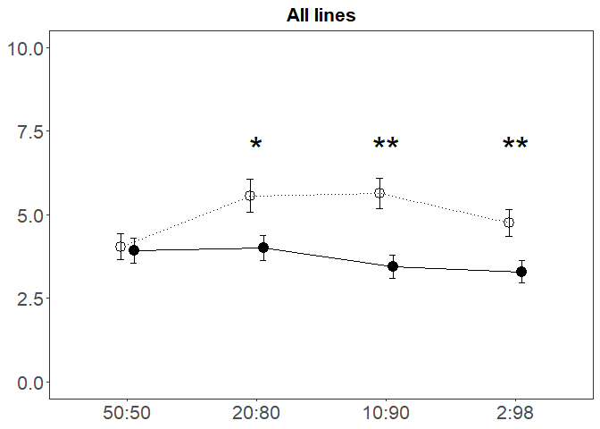<!-- -->

``` r
# summarize the data (each plant line)
sum.LHT_nod.lsm$nod <- sum.LHT_nod.lsm$rate

# plot: nod ~ line:treat:half (significant interaction, interval)
(plot.LHT.nod <- ggplot(sum.LHT_nod.lsm,
                    aes(x=treat, y=nod, shape=half, group=half)) + 
  geom_point(size=4, position=position_dodge(0.2)) + 
  geom_line(aes(linetype=half), position=position_dodge(0.2)) +  
  geom_errorbar(aes(ymin=nod-SE, ymax=nod+SE), 
                width=.1, position=position_dodge(0.2)) +
  theme_bw() +
  xlab(NULL) + 
  ylab(NULL) +
  ggtitle("All lines") +
  facet_wrap(~line, scales="fixed") +
  scale_fill_discrete(name="Root half") +
  scale_linetype_manual(name="Root half",
                        values=c(3,1)) +
  scale_shape_manual(name="Root half",
                     values=c(1,19)) +   
  theme(axis.text.y = element_text(size=16), 
        axis.title.y = element_blank(),
        axis.title.x = element_blank(),
        axis.text.x = element_text(size=16), 
        legend.title = element_text(colour="black", size=16, face="bold"),
        legend.text = element_text(colour="black", size=14),
        legend.position="none",
        plot.title = element_text(hjust=0.5, size=16, face = "bold"),
        panel.grid.major = element_blank(), 
        panel.grid.minor = element_blank()))
```

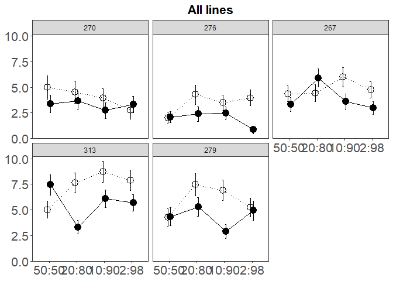<!-- -->

``` r
# subset for each line

(plot.nod.270 <- ggplot(subset(sum.LHT_nod.lsm, line %in% c("270")),
                    aes(x=treat, y=nod, shape=half, group=half)) + 
  geom_point(size=4, position=position_dodge(0.2)) + 
  geom_line(aes(linetype=half), position=position_dodge(0.2)) +  
  geom_errorbar(aes(ymin=nod-SE, ymax=nod+SE), 
                width=.1, position=position_dodge(0.2)) +
  theme_bw() +
  xlab(NULL) + 
  ylab(NULL) +
  ggtitle("270") +
  scale_fill_discrete(name="Root half") +
  scale_linetype_manual(name="Root half",
                        values=c(3,1)) +
  scale_shape_manual(name="Root half",
                     values=c(1,19)) +   
  scale_y_continuous(limits = c(0, 10), breaks = seq(0, 10, by = 2.5)) +
  theme(axis.text.y = element_text(size=16), 
        axis.title.y = element_blank(),
        axis.text.x = element_blank(),
        axis.title.x = element_blank(),
        legend.title = element_text(colour="black", size=16, face="bold"),
        legend.text = element_text(colour="black", size=14),
        legend.position = c(0.2, 0.85),
        legend.background = element_blank(),
        legend.box.background = element_blank(),
        plot.title = element_text(hjust=0.5, size=16, face = "bold"),
        panel.grid.major = element_blank(), 
        panel.grid.minor = element_blank()
        )
  )
```

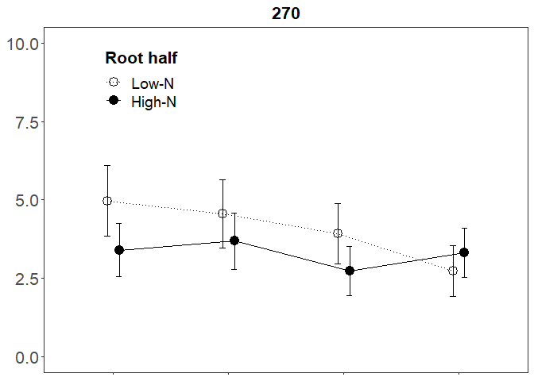<!-- -->

``` r
(plot.nod.276 <- ggplot(subset(sum.LHT_nod.lsm, line %in% c("276")),
                    aes(x=treat, y=nod, shape=half, group=half)) + 
  geom_point(size=4, position=position_dodge(0.2)) + 
  geom_line(aes(linetype=half), position=position_dodge(0.2)) +  
  geom_errorbar(aes(ymin=nod-SE, ymax=nod+SE), 
                width=.1, position=position_dodge(0.2)) +
  annotate("text", x = 4, y = 7, label = "***", size=10) +
  theme_bw() +
  xlab(NULL) + 
  ylab(NULL) +
  ggtitle("276") +
  scale_fill_discrete(name="Root half") +
  scale_linetype_manual(name="Root half",
                        values=c(3,1)) +
  scale_shape_manual(name="Root half",
                     values=c(1,19)) +   
  scale_y_continuous(limits = c(0, 10), breaks = seq(0, 10, by = 2.5)) +
  theme(axis.text.y = element_text(size=16), 
        axis.title.y = element_blank(),
        axis.text.x = element_blank(),
        axis.title.x = element_blank(),
        legend.title = element_text(colour="black", size=16, face="bold"),
        legend.text = element_text(colour="black", size=14),
        legend.position="none",
        plot.title = element_text(hjust=0.5, size=16, face = "bold"),
        panel.grid.major = element_blank(), 
        panel.grid.minor = element_blank()
        )
  )
```

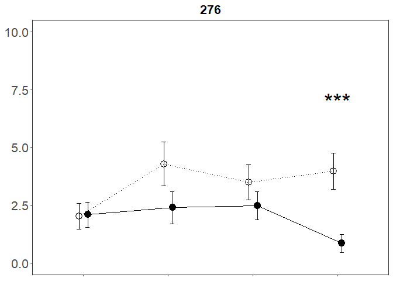<!-- -->

``` r
(plot.nod.267 <- ggplot(subset(sum.LHT_nod.lsm, line %in% c("267")),
                    aes(x=treat, y=nod, shape=half, group=half)) + 
  geom_point(size=4, position=position_dodge(0.2)) + 
  geom_line(aes(linetype=half), position=position_dodge(0.2)) +  
  geom_errorbar(aes(ymin=nod-SE, ymax=nod+SE), 
                width=.1, position=position_dodge(0.2)) +
  annotate("text", x = 4, y = 9, label = ".", size=20) +
  theme_bw() +
  xlab(NULL) + 
  ylab(NULL) +
  ggtitle("267") +
  scale_fill_discrete(name="Root half") +
  scale_linetype_manual(name="Root half",
                        values=c(3,1)) +
  scale_shape_manual(name="Root half",
                     values=c(1,19)) +   
  scale_y_continuous(limits = c(0, 10), breaks = seq(0, 10, by = 2.5)) +
  theme(axis.text.y = element_text(size=16), 
        axis.title.y = element_blank(),
        axis.text.x = element_blank(),
        axis.title.x = element_blank(),
        legend.title = element_text(colour="black", size=16, face="bold"),
        legend.text = element_text(colour="black", size=14),
        legend.position="none",
        plot.title = element_text(hjust=0.5, size=16, face = "bold"),
        panel.grid.major = element_blank(), 
        panel.grid.minor = element_blank()
        )
  )
```

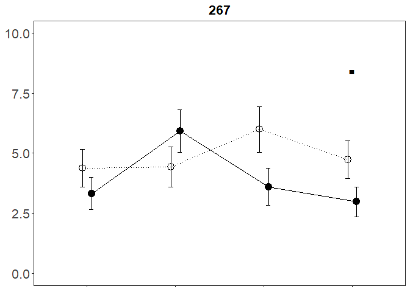<!-- -->

``` r
(plot.nod.313 <- ggplot(subset(sum.LHT_nod.lsm, line %in% c("313")),
                    aes(x=treat, y=nod, shape=half, group=half)) + 
  geom_point(size=4, position=position_dodge(0.2)) + 
  geom_line(aes(linetype=half), position=position_dodge(0.2)) +  
  geom_errorbar(aes(ymin=nod-SE, ymax=nod+SE), width=.1, position=position_dodge(0.2)) +
  annotate("text", x = 2, y = 10, label = "***", size=10) +
  annotate("text", x = 3, y = 10, vjust=0.0001, label = ".", size=20) +  
  theme_bw() +
  xlab(NULL) + 
  ylab(NULL) +
  ggtitle("313") +
  scale_fill_discrete(name="Root half") +
  scale_linetype_manual(name="Root half",
                        values=c(3,1)) +
  scale_shape_manual(name="Root half",
                     values=c(1,19)) +   
  scale_y_continuous(limits = c(0, 10), breaks = seq(0, 10, by = 2.5)) +
  theme(axis.text.y = element_text(size=16), 
        axis.title.y = element_blank(),
        axis.title.x = element_blank(),
        axis.text.x = element_text(size=16), 
        legend.title = element_text(colour="black", size=16, face="bold"),
        legend.text = element_text(colour="black", size=14),
        legend.position="none",
        plot.title = element_text(hjust=0.5, size=16, face = "bold"),
        panel.grid.major = element_blank(), 
        panel.grid.minor = element_blank()
        )
  )
```

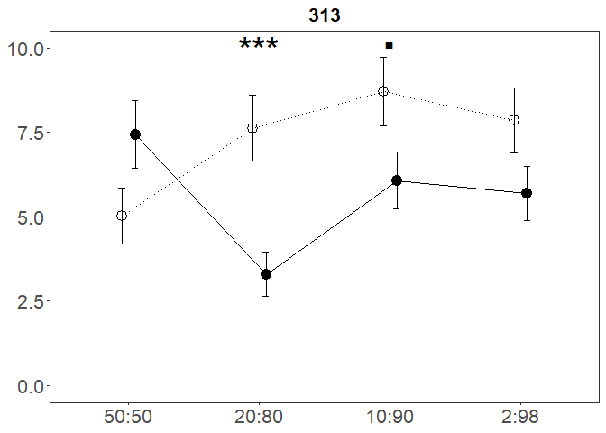<!-- -->

``` r
(plot.nod.279 <- ggplot(subset(sum.LHT_nod.lsm, line %in% c("279")),
                    aes(x=treat, y=nod, shape=half, group=half)) + 
  geom_point(size=4, position=position_dodge(0.2)) + 
  geom_line(aes(linetype=half), position=position_dodge(0.2)) +  
  geom_errorbar(aes(ymin=nod-SE, ymax=nod+SE), 
                width=.1, position=position_dodge(0.2)) +
  annotate("text", x=3, y=9, label="**", size=10) +
  theme_bw() +
  xlab(NULL) + 
  ylab(NULL) +
  ggtitle("279") +
  scale_fill_discrete(name="Root half") +
  scale_linetype_manual(name="Root half",
                        values=c(3,1)) +
  scale_shape_manual(name="Root half",
                     values=c(1,19)) +   
  scale_y_continuous(limits = c(0, 10), breaks = seq(0, 10, by = 2.5)) +
  theme(axis.text.y = element_text(size=16), 
        axis.title.y = element_blank(),
        axis.title.x = element_blank(),
        axis.text.x = element_text(size=16), 
        legend.title = element_text(colour="black", size=16, face="bold"),
        legend.text = element_text(colour="black", size=14),
        legend.position="none",
        plot.title = element_text(hjust=0.5, size=16, face = "bold"),
        panel.grid.major = element_blank(), 
        panel.grid.minor = element_blank()
        )
  )
```

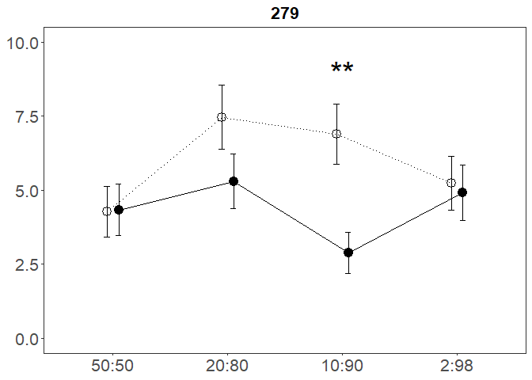<!-- -->

``` r
# use cowplot to make figure 2

# plot the graphs into a grid (note: all axes titles have been removed. 
#Also removed legends from all plots but one, for adding the legend in below)
fig2_base <- plot_grid(plot.nod.270,
                        plot.nod.276, plot.nod.267, 
                        plot.nod.313, plot.nod.279, plot.nod.all,
          align = "v",
          ncol = 3)

# add on the shared x axis title
fig2_x_axis <- add_sub(fig2_base, "N-heterogeneity", size=24)

# add on the shared y axis title
fig2_y_axis <- ggdraw() + draw_label("Nodules (no.)", size = 24, angle=90)

# put them together
fig2 <- plot_grid(fig2_y_axis, fig2_x_axis, ncol=2, rel_widths=c(0.05, 1)) 
# rel_heights or widths values control text margins

save_plot("./figures_files/Fig2_nodulation.pdf", fig2,
          ncol = 3, # we're saving a grid plot of 3 columns
          nrow = 2, # and 2 rows
          # each individual subplot should have an aspect ratio of 1.3
          base_aspect_ratio = 1.3
          )
```

#### Figures 3 (regression) and 4 (partner choice)

``` r
## from raw data

plants_long_strain.nod <- plants_long_strain[complete.cases(plants_long_strain[ ,
                                                    c("nod","root"),]),]
plants_long_strain.nod <- droplevels(plants_long_strain.nod)

# Figure: nod ~ root:treat:half
(fig3_all <- ggplot(plants_long_strain.nod, aes(x=(root*1000), y=nod, 
                                            linetype=half, shape=half)) + 
  geom_point(size=2) + 
  geom_smooth(method="lm", colour="black") +
  theme_bw() +
  xlab("Root biomass (mg)") + 
  ylab("Nodules (no.)") +
  facet_grid(.~treat, scales="fixed") +
  scale_linetype_manual(name="Root half",
                        values=c(3,1)) +
  scale_shape_manual(name="Root half",
                     values=c(1,19)) + 
  theme(axis.title.y = element_text(colour = "black", size = 24), 
        axis.text.y = element_text(size=18), 
        axis.title.x = element_text(size=24), 
        axis.text.x = element_text(size=18), 
        legend.title = element_text(colour="black", size=16, face="bold"),
        legend.text = element_text(colour="black", size=14),
        strip.text = element_text(size=16, face="bold"),
        legend.position=c(0.08, 0.96),
        panel.grid.major = element_blank(), 
        panel.grid.minor = element_blank()
        )
 )
```

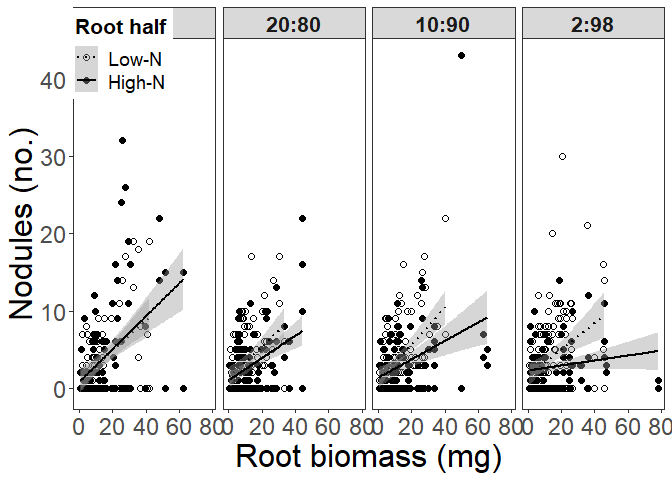<!-- -->

``` r
# subset
(fig3_cont <- ggplot(data=subset(plants_long_strain.nod, treat %in% c('50:50')), 
                     aes(x=(root*1000), y=nod, 
                                            linetype=half, shape=half)) + 
  geom_point(size=2) + 
  geom_smooth(method="lm", colour="black") +
  theme_bw() +
  xlab(NULL) + 
  ylab(NULL) +
  ggtitle("50:50")  +
  annotate("text", x = 70, y = 30, label = "NS", size=8) +  
  scale_y_continuous(limits=c(0, 45), breaks=seq(0, 45, 10)) +
  scale_x_continuous(limits=c(0, 80), breaks=seq(0, 80, 20)) +
  scale_linetype_manual(name="Root half",
                        values=c(3,1)) +
  scale_shape_manual(name="Root half",
                     values=c(1,19)) + 
  theme(axis.title.y = element_text(colour = "black", size = 24), 
        axis.text.y = element_text(size=18), 
        axis.title.x = element_text(size=24), 
        axis.text.x = element_text(size=18), 
        legend.title = element_text(colour="black", size=16, face="bold"),
        legend.text = element_text(colour="black", size=14),
        legend.background = element_blank(),
        legend.box.background = element_blank(),
        plot.title = element_text(hjust=0.5, size=20, face = "bold"),
        legend.position=c(0.2, 0.85),
        panel.grid.major = element_blank(), 
        panel.grid.minor = element_blank()
        )
  )
```

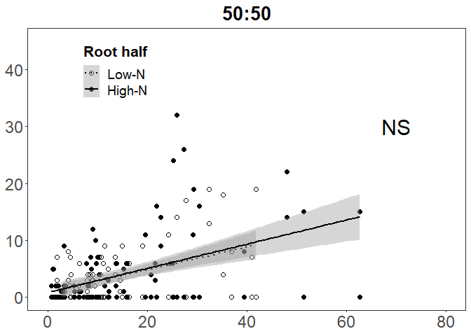<!-- -->

``` r
(fig3_two <- ggplot(data=subset(plants_long_strain.nod, treat %in% c('20:80')), 
                     aes(x=(root*1000), y=nod, 
                                            linetype=half, shape=half)) + 
  geom_point(size=2) + 
  geom_smooth(method="lm", colour="black") +
  theme_bw() +
  xlab(NULL) + 
  ylab(NULL) +
  ggtitle("20:80")  +
  annotate("text", x = 70, y = 30, label = "p = 0.0892", size=8) +    
  scale_y_continuous(limits=c(0, 45), breaks=seq(0, 45, 10)) +
  scale_x_continuous(limits=c(0, 80), breaks=seq(0, 80, 20)) + 
  scale_linetype_manual(name="Root half",
                        values=c(3,1)) +
  scale_shape_manual(name="Root half",
                     values=c(1,19)) + 
  theme(axis.title.y = element_text(colour = "black", size = 24), 
        axis.text.y = element_text(size=18), 
        axis.title.x = element_text(size=24), 
        axis.text.x = element_text(size=18), 
        legend.title = element_text(colour="black", size=16, face="bold"),
        legend.text = element_text(colour="black", size=14),
        plot.title = element_text(hjust=0.5, size=20, face = "bold"),
        legend.position="none",
        panel.grid.major = element_blank(), 
        panel.grid.minor = element_blank()
        )
  )
```

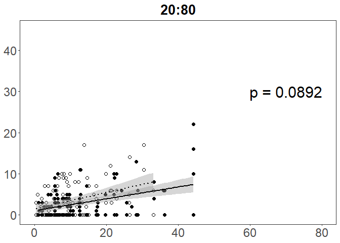<!-- -->

``` r
(fig3_three <- ggplot(data=subset(plants_long_strain.nod, treat %in% c('10:90')), 
                     aes(x=(root*1000), y=nod, 
                                            linetype=half, shape=half)) + 
  geom_point(size=2) + 
  geom_smooth(method="lm", colour="black") +
  theme_bw() +
  xlab(NULL) + 
  ylab(NULL) +
  ggtitle("10:90")  +
  annotate("text", x = 65, y = 30, label = "p = 0.00848", size=8) +    
  scale_y_continuous(limits=c(0, 45), breaks=seq(0, 45, 10)) +
  scale_x_continuous(limits=c(0, 80), breaks=seq(0, 80, 20)) +   
  scale_linetype_manual(name="Root half",
                        values=c(3,1)) +
  scale_shape_manual(name="Root half",
                     values=c(1,19)) + 
  theme(axis.title.y = element_text(colour = "black", size = 24), 
        axis.text.y = element_text(size=18), 
        axis.title.x = element_text(size=24), 
        axis.text.x = element_text(size=18), 
        legend.title = element_text(colour="black", size=16, face="bold"),
        legend.text = element_text(colour="black", size=14),
        plot.title = element_text(hjust=0.5, size=20, face = "bold"),
        legend.position="none",
        panel.grid.major = element_blank(), 
        panel.grid.minor = element_blank()
        )
  )
```

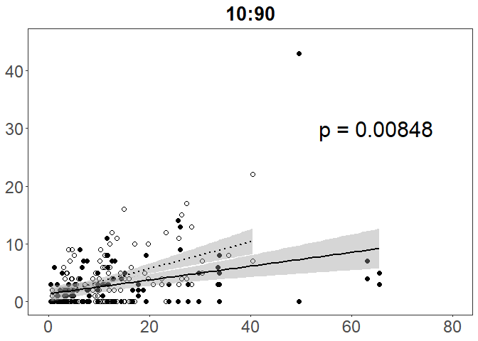<!-- -->

``` r
(fig3_four <- ggplot(data=subset(plants_long_strain.nod, treat %in% c('2:98')), 
                     aes(x=(root*1000), y=nod, 
                                            linetype=half, shape=half)) + 
  geom_point(size=2) + 
  geom_smooth(method="lm", colour="black") +
  theme_bw() +
  xlab(NULL) + 
  ylab(NULL) +
  ggtitle("2:98")  +
  annotate("text", x = 65, y = 30, label = "p = 0.0167", size=8) +    
  scale_y_continuous(limits=c(0, 45), breaks=seq(0, 45, 10)) +
  scale_x_continuous(limits=c(0, 80), breaks=seq(0, 80, 20)) +    
  scale_linetype_manual(name="Root half",
                        values=c(3,1)) +
  scale_shape_manual(name="Root half",
                     values=c(1,19)) + 
  theme(axis.title.y = element_text(colour = "black", size = 24), 
        axis.text.y = element_text(size=18), 
        axis.title.x = element_text(size=24), 
        axis.text.x = element_text(size=18), 
        legend.title = element_text(colour="black", size=16, face="bold"),
        legend.text = element_text(colour="black", size=14),
        plot.title = element_text(hjust=0.5, size=20, face = "bold"),
        legend.position="none",
        panel.grid.major = element_blank(), 
        panel.grid.minor = element_blank()
        )
  )
```

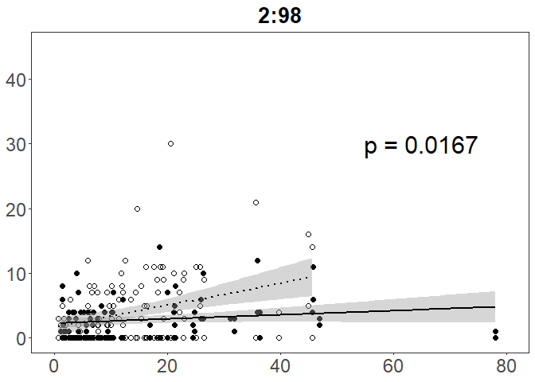<!-- -->

``` r
# use cowplot to make figure 3

# plot the graphs into a grid (note: all axes titles have been removed. 
#Also removed legends from all plots but one, for adding the legend in below)
fig3_base <- plot_grid(fig3_cont, fig3_two,
                        fig3_three, fig3_four,
          align = "vh",
          ncol = 2)

# add on the shared x axis title
fig3_x_axis <- add_sub(fig3_base, "Root biomass (mg)", size=24)

# add on the shared y axis title
fig3_y_axis <- ggdraw() + draw_label("Nodules (no.)", size = 24, angle=90)

# put them together
fig3 <- plot_grid(fig3_y_axis, fig3_x_axis, ncol=2, rel_widths=c(0.05, 1)) 
# rel_heights or widths values control text margins

save_plot("./figures_files/Fig3_reg.pdf", fig3,
          ncol = 3, # we're saving a grid plot of 3 columns
          nrow = 3, # and 2 rows
          # each individual subplot should have an aspect ratio of 1.3
          base_aspect_ratio = 1.3
          )

# lsmeans
sum.SHT_nod.lsm$nod <- sum.SHT_nod.lsm$rate
require(ggplot2)

(plot_nod_SHT_all <- ggplot(sum.SHT_nod.lsm,
                    aes(x=treat, y=nod, shape=half, group=half)) + 
  geom_point(size=4, position=position_dodge(0.2)) + 
  geom_line(aes(linetype=half), position=position_dodge(0.2)) +  
  geom_errorbar(aes(ymin=nod-SE, 
                    ymax=nod+SE), width=.1, position=position_dodge(0.2), color="black") +
  theme_bw() +
  xlab(NULL) + 
  ylab(NULL) +
  ggtitle("All lines") +
  facet_wrap(~strain, scales="fixed") +
  scale_fill_discrete(name="Root half") +
  scale_linetype_manual(name="Root half",
                        values=c(3,1)) +
  scale_shape_manual(name="Root half",
                     values=c(1,19)) +   
  theme(axis.text.y = element_text(size=16), 
        axis.title.y = element_blank(),
        axis.title.x = element_blank(),
        axis.text.x = element_text(size=16), 
        legend.title = element_text(colour="black", size=16, face="bold"),
        legend.text = element_text(colour="black", size=14),
        strip.text = element_text(size=16, face="bold"),
        legend.position=c(0.06, 0.9),
        plot.title = element_text(hjust=0.5, size=16, face = "bold"),
        panel.grid.major = element_blank(), 
        panel.grid.minor = element_blank()
        )
  )
```

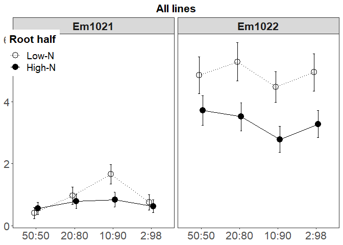<!-- -->

``` r
# subset for strain
(plot_nod_SHT_Em1021 <- ggplot(data=subset(sum.SHT_nod.lsm, strain %in% c('Em1021')),
                    aes(x=treat, y=nod, shape=half, group=half)) + 
  geom_point(size=4, position=position_dodge(0.2)) + 
  geom_line(aes(linetype=half), position=position_dodge(0.2)) +  
  geom_errorbar(aes(ymin=nod-SE, 
                    ymax=nod+SE), width=.1, position=position_dodge(0.2), color="black") +
  annotate("text", x = 3, y = 3, label = "*", size=10) +
  theme_bw() +
  xlab(NULL) + 
  ylab(NULL) +
  ggtitle("Em1021") +
  scale_fill_discrete(name="Root half") +
  scale_linetype_manual(name="Root half",
                        values=c(3,1)) +
  scale_shape_manual(name="Root half",
                     values=c(1,19)) +   
  scale_y_continuous(limits=c(0, 7), breaks=seq(0, 7, 2)) +
  theme(axis.text.y = element_text(size=16), 
        axis.title.y = element_blank(),
        axis.title.x = element_blank(),
        axis.text.x = element_text(size=16), 
        legend.title = element_text(colour="black", size=16, face="bold"),
        legend.text = element_text(colour="black", size=14),
        legend.background = element_blank(),
        legend.box.background = element_blank(),
        strip.text = element_text(size=16, face="bold"),
        legend.position=c(0.2, 0.85),
        plot.title = element_text(hjust=0.5, size=16, face = "bold"),
        panel.grid.major = element_blank(), 
        panel.grid.minor = element_blank()
        )
  )
```

<!-- -->

``` r
(plot_nod_SHT_Em1022 <- ggplot(data=subset(sum.SHT_nod.lsm, strain %in% c('Em1022')),
                    aes(x=treat, y=nod, shape=half, group=half)) + 
  geom_point(size=4, position=position_dodge(0.2)) + 
  geom_line(aes(linetype=half), position=position_dodge(0.2)) +  
  geom_errorbar(aes(ymin=nod-SE, 
                    ymax=nod+SE), width=.1, position=position_dodge(0.2), color="black") +
  annotate("text", x = 2, y = 6, label = "*", size=10) +
  annotate("text", x = 3, y = 6, label = "**", size=10) +  
  annotate("text", x = 4, y = 6, label = "**", size=10) +   
  theme_bw() +
  xlab(NULL) + 
  ylab(NULL) +
  ggtitle("Em1022") +
  scale_fill_discrete(name="Root half") +
  scale_linetype_manual(name="Root half",
                        values=c(3,1)) +
  scale_shape_manual(name="Root half",
                     values=c(1,19)) +   
  scale_y_continuous(limits=c(0, 7), breaks=seq(0, 7, 2)) +
  theme(axis.text.y = element_text(size=16), 
        axis.title.y = element_blank(),
        axis.title.x = element_blank(),
        axis.text.x = element_text(size=16), 
        legend.title = element_text(colour="black", size=16, face="bold"),
        legend.text = element_text(colour="black", size=14),
        strip.text = element_text(size=16, face="bold"),
        legend.position="none",
        plot.title = element_text(hjust=0.5, size=16, face = "bold"),
        panel.grid.major = element_blank(), 
        panel.grid.minor = element_blank()
        )
  )
```

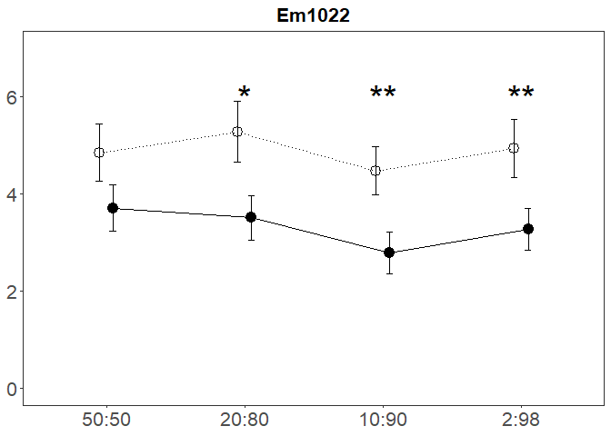<!-- -->

``` r
# use cowplot to make figure 4

# plot the graphs into a grid (note: all axes titles have been removed. 
#Also removed legends from all plots but one, for adding the legend in below)
fig4_base <- plot_grid(plot_nod_SHT_Em1021, plot_nod_SHT_Em1022,
          align = "h",
          ncol = 2)

# add on the shared x axis title
fig4_x_axis <- add_sub(fig4_base, "N-heterogeneity", size=24)

# add on the shared y axis title
fig4_y_axis <- ggdraw() + draw_label("Nodules (no.)", size = 24, angle=90)

# put them together
fig4 <- plot_grid(fig4_y_axis, fig4_x_axis, ncol=2, rel_widths=c(0.05, 1)) 
# rel_heights or widths values control text margins

save_plot("./figures_files/Fig4_partner_choice.pdf", fig4,
          ncol = 3, # we're saving a grid plot of 3 columns
          nrow = 2, # and 2 rows
          # each individual subplot should have an aspect ratio of 1.3
          base_aspect_ratio = 1.3
          )
```

#### Figure S2: Whole-plant traits

``` r
# calculate whole-plant differences in preference
plants$tot_1022 <- plants$high_1022 + plants$low_1022
plants$pref <- (plants$tot_1022)/plants$tot_nod

# summarize traits
plants_sum1 <- plants %>%
  group_by(line) %>%
  summarize(count = n(),
    mean_shoot = mean(shoot, na.rm = TRUE),
            SE_shoot = sd(shoot, na.rm = TRUE)/sqrt(count),
    mean_root = mean(tot_root, na.rm = TRUE),
            SE_root = sd(tot_root, na.rm = TRUE)/sqrt(count),
    mean_nod = mean(tot_nod, na.rm = TRUE),
            SE_nod = sd(tot_nod, na.rm = TRUE)/sqrt(count)
    ) 

plants_sum1$shoot.t <- plants_sum1$mean_shoot*1000
plants_sum1$se_shoot.t <- plants_sum1$SE_shoot*1000

# plot: shoot ~ line (significant interaction, interval plot)
(plot.shoot <- ggplot(plants_sum1, aes(x=line, y=shoot.t)) + 
  geom_point(size=5, position=position_dodge(0.2)) + 
  geom_errorbar(aes(ymin=shoot.t-se_shoot.t, ymax=shoot.t+se_shoot.t), width=.1, 
                position=position_dodge(0.2)) +
  geom_text(aes(label=count), hjust = "left", nudge_x = 0.15)  +
  theme_bw() +
  xlab("Plant line") + 
  ylab("Shoot biomass (mg)") +
  theme(axis.text.y = element_text(size=16), 
        axis.title.y = element_text(size=20), 
        axis.text.x = element_blank(),
        axis.title.x = element_blank(),
        legend.title = element_text(colour="black", size=16, face="bold"),
        legend.text = element_text(colour="black", size=14),
        legend.position="none",
        plot.title = element_text(hjust=0.5, size=16, face = "bold"),
        panel.grid.major = element_blank(), 
        panel.grid.minor = element_blank()
        )
  )
```

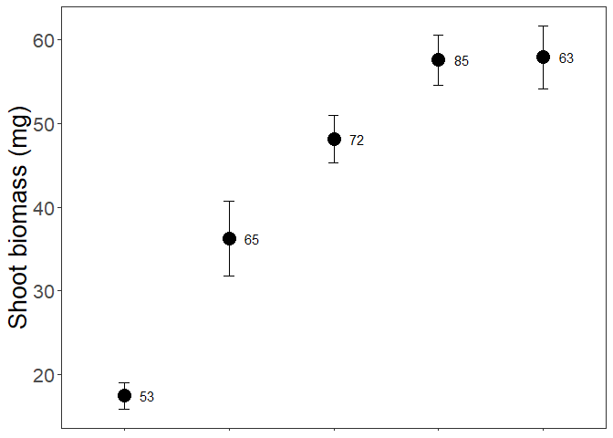<!-- -->

``` r
# tot_root
plants_sum1$tot_root.t <- plants_sum1$mean_root*1000
plants_sum1$se_root.t <- plants_sum1$SE_root*1000

# plot: tot_root ~ line (significant interaction, interval plot)
(plot.tot_root <- ggplot(plants_sum1, aes(x=line, y=tot_root.t)) + 
  geom_point(size=4, position=position_dodge(0.2)) + 
  geom_errorbar(aes(ymin=tot_root.t-se_root.t, ymax=tot_root.t+se_root.t), width=.1, 
                position=position_dodge(0.2)) +
  geom_text(aes(label=count), hjust = "left", nudge_x = 0.1)  +
  theme_bw() +
  xlab(NULL) + 
  ylab("Root biomass (mg)") +
  theme(axis.text.y = element_text(size=16), 
        axis.title.y = element_text(size=20), 
        axis.text.x = element_blank(),
        axis.title.x = element_blank(),
        legend.title = element_text(colour="black", size=16, face="bold"),
        legend.text = element_text(colour="black", size=14),
        legend.position="none",
        plot.title = element_text(hjust=0.5, size=16, face = "bold"),
        panel.grid.major = element_blank(), 
        panel.grid.minor = element_blank()
        )
  )
```

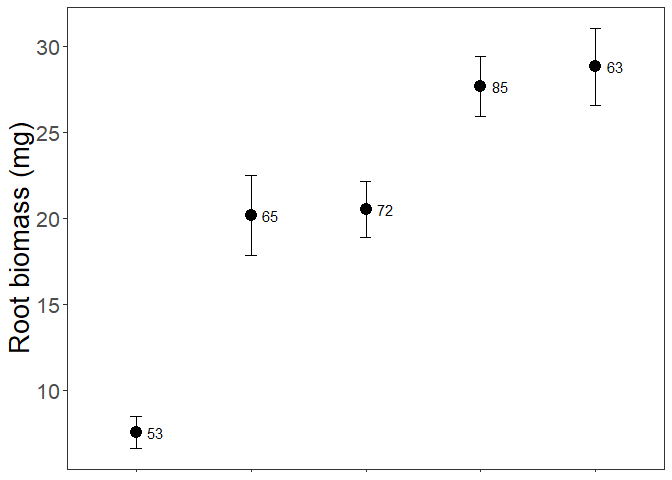<!-- -->

``` r
# plot: tot_nod ~ line (significant interaction, interval plot)
(plot.tot_nod <- ggplot(plants_sum1, aes(x=line, y=mean_nod)) + 
  geom_point(size=4, position=position_dodge(0.2)) + 
  geom_errorbar(aes(ymin=mean_nod-SE_nod, ymax=mean_nod+SE_nod), width=.1, 
                position=position_dodge(0.2)) +
  geom_text(aes(label=count), hjust = "left", nudge_x = 0.15)  +
  theme_bw() +
  xlab(NULL) + 
  ylab("Nodules (no.)") +
  theme(axis.text.y = element_text(size=16), 
        axis.title.y = element_text(size=20), 
        axis.title.x = element_blank(),
        axis.text.x = element_text(size=16), 
        legend.title = element_text(colour="black", size=16, face="bold"),
        legend.text = element_text(colour="black", size=14),
        legend.position="none",
        plot.title = element_text(hjust=0.5, size=16, face = "bold"),
        panel.grid.major = element_blank(), 
        panel.grid.minor = element_blank()
        )
  )
```

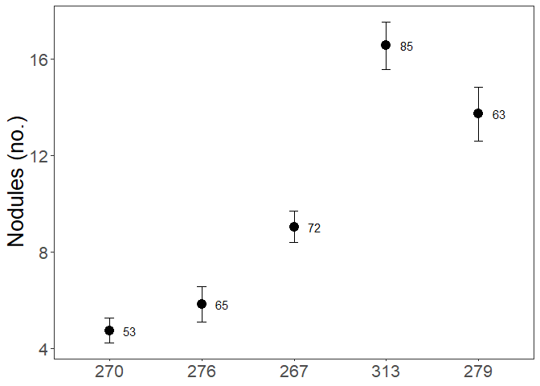<!-- -->

``` r
# pref
plants_sum2 <- plants %>%
  filter(pref > 0) %>%
  group_by(line) %>%
  summarize(count = n(),
    mean_pref = mean(pref, na.rm = TRUE),
      SE_pref = sd(pref, na.rm = TRUE)/sqrt(count)
  )

# plot: pref ~ line (significant interaction, interval plot)
(plot.pref <- ggplot(plants_sum2, aes(x=line, y=mean_pref)) + 
  geom_point(size=4, position=position_dodge(0.2)) + 
  geom_errorbar(aes(ymin=mean_pref-SE_pref, ymax=mean_pref+SE_pref), width=.1, 
                position=position_dodge(0.2)) +
  geom_text(aes(label=count), hjust = "left", nudge_x = 0.15)  +
  theme_bw() +
  xlab(NULL) + 
  ylab("Partner choice") +
  theme(axis.text.y = element_text(size=16), 
        axis.title.y = element_text(size=20), 
        axis.title.x = element_blank(),
        axis.text.x = element_text(size=16), 
        legend.title = element_text(colour="black", size=16, face="bold"),
        legend.text = element_text(colour="black", size=14),
        legend.position="none",
        plot.title = element_text(hjust=0.5, size=16, face = "bold"),
        panel.grid.major = element_blank(), 
        panel.grid.minor = element_blank()
        )
  )
```

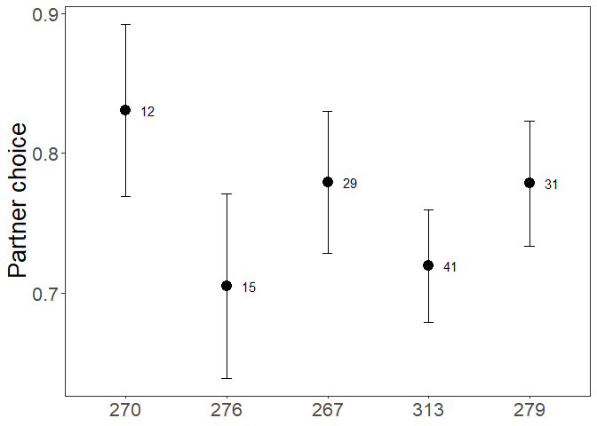<!-- -->

``` r
# use cowplot to make figure S1

# plot the graphs into a grid (note: all axes titles have been removed. 
# Also removed legends from all plots but one, for adding the legend in below)
figS2_base <- plot_grid(plot.shoot,  plot.tot_root,
                         plot.tot_nod, plot.pref, 
          align = "hv",
          ncol = 2,
          labels = c("A", "B", "C", "D"))

# add on the shared x axis title
figS2 <- add_sub(figS2_base, "Plant line", size=24)

# save
save_plot("./figures_files/FigS2_Whole_plant_traits.pdf", figS2,
          ncol = 2, # we're saving a grid plot of 3 columns
          nrow = 2, # and 2 rows
          # each individual subplot should have an aspect ratio of 1.3
          base_aspect_ratio = 1.3
          )
```
