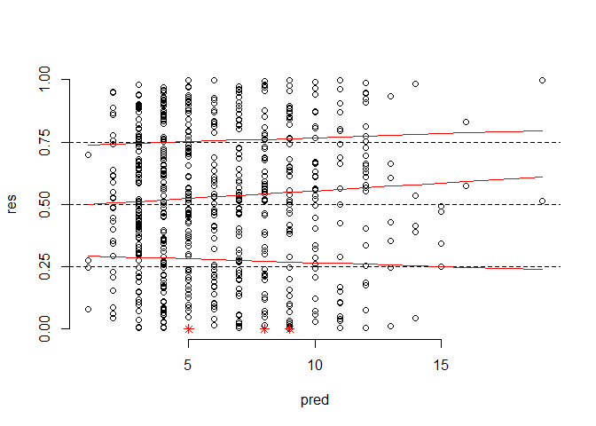
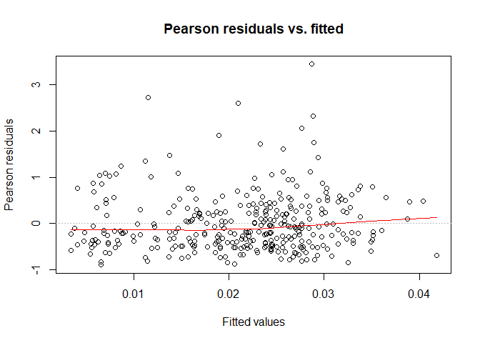

Whole root, half root, and strain models
================
Rebecca Batstone
2020-02-01

## load packages

``` r
library("tidyverse") ## includes ggplot2, dplyr, readr, stringr
library("reshape2") ## for melting datasheets
library("car") ## Anova function
library("cowplot") # paneled graphs
library("lme4") ## mixed effects models
library("knitr") ## knit analyses files
library("multcomp") ## post-hoc comps
library("multcompView") ## summarize key variables
library("fitdistrplus") ## determine best prob distributions
library("logspline") ## visualize prob dists
library("DHARMa") ## residual diagnostics for GLMMs
library("RVAideMemoire") ## residual diagnotics
library("emmeans") ## post-hoc contrasts, lsmeans
library("lattice") ## graphs

#model convergence packages
library("numDeriv")
# library("RCurl") ## to source() from Github
library("RColorBrewer") ## graph colors

source("./overdisp.R")
```

## load data

``` r
load("./prepped_data/plants.Rdata")
load("./prepped_data/plants_long.Rdata")
load("./prepped_data/plants_long_strain.Rdata")
```

## Set contrasts

<https://rstudio-pubs-static.s3.amazonaws.com/65059_586f394d8eb84f84b1baaf56ffb6b47f.html>

“By default, R uses traditional dummy coding (called “treatment
contrasts” in R) for any non-ordered factors, and polynomial trend
contrasts for any ordered factors. That works out well if you intend to
look at regression coefficients"

“Note that traditional dummy coding is fine for regression coefficients,
but since traditional dummy codes aren’t orthogonal, it messes things up
when you’re just trying to partition variance (i.e. an ANOVA).”

“For an ANOVA, you should set your factors to use effects coding, rather
than relying on the default treatment codes. You can do that with the
contr.sum() function”

``` r
# set effects contrasts (treat is an ordered factor w/ 4 levels, half with 2-lvls)
options(contrasts = c("contr.sum","contr.poly")) 
```

## Model 1: root growth in reponse to N-heterogeneity

``` r
plants_long.root <- plants_long[complete.cases(plants_long[ , c("root","nod"),]),]
plants_long.root <- droplevels(plants_long.root)
# str(plants_long.root)
## 638 obs.

# determine best probability distribution for data
ggplot(plants_long.root, aes(x = root.t)) + geom_density() + facet_grid(treat~half)
```

<!-- -->

``` r
## right-skewed

require(fitdistrplus)
require(logspline)

descdist(plants_long.root$root, discrete = FALSE)
```

<!-- -->

    ## summary statistics
    ## ------
    ## min:  4e-04   max:  0.078 
    ## median:  0.0081 
    ## mean:  0.01149212 
    ## estimated sd:  0.01137209 
    ## estimated skewness:  1.962132 
    ## estimated kurtosis:  8.000271

``` r
## exponential, beta, gamma
fit.gamma <- fitdist(plants_long.root$root.t, "gamma")
# fit.beta <- fitdist(plants_long.root$root.t, "beta") # has to be 0-1
fit.exp <- fitdist(plants_long.root$root.t, "exp")
plot(fit.gamma)
```

<!-- -->

``` r
plot(fit.exp)
```

<!-- -->

``` r
fit.gamma$aic 
```

    ## [1] 4385.716

``` r
fit.exp$aic
```

    ## [1] 4393.56

``` r
## Gamma, exp (best to worst)

# model for half
m1 <- glmer(root ~ (nod + line) * (treat/half) +
               (1|batch/tray/plant), 
               family = Gamma(link = "sqrt"),
               data = plants_long.root,
               control=glmerControl(optimizer="nloptwrap",
                            optCtrl=list(maxfun=2e4)))
summary(m1)
```

    ## Generalized linear mixed model fit by maximum likelihood (Laplace
    ##   Approximation) [glmerMod]
    ##  Family: Gamma  ( sqrt )
    ## Formula: root ~ (nod + line) * (treat/half) + (1 | batch/tray/plant)
    ##    Data: plants_long.root
    ## Control: 
    ## glmerControl(optimizer = "nloptwrap", optCtrl = list(maxfun = 20000))
    ## 
    ##      AIC      BIC   logLik deviance df.resid 
    ##  -4854.7  -4622.9   2479.4  -4958.7      586 
    ## 
    ## Scaled residuals: 
    ##     Min      1Q  Median      3Q     Max 
    ## -1.5544 -0.6014 -0.0741  0.5248  5.2672 
    ## 
    ## Random effects:
    ##  Groups             Name        Variance  Std.Dev.
    ##  plant:(tray:batch) (Intercept) 2.732e-04 0.016528
    ##  tray:batch         (Intercept) 1.272e-05 0.003567
    ##  batch              (Intercept) 3.051e-05 0.005524
    ##  Residual                       3.656e-01 0.604670
    ## Number of obs: 638, groups:  
    ## plant:(tray:batch), 337; tray:batch, 23; batch, 12
    ## 
    ## Fixed effects:
    ##                           Estimate Std. Error t value Pr(>|z|)    
    ## (Intercept)              6.288e-02  3.362e-03  18.702  < 2e-16 ***
    ## nod                      6.443e-03  3.441e-04  18.721  < 2e-16 ***
    ## line1                   -1.791e-02  3.200e-03  -5.597 2.18e-08 ***
    ## line2                    1.065e-02  3.228e-03   3.300 0.000967 ***
    ## line3                    5.080e-03  2.967e-03   1.712 0.086857 .  
    ## line4                   -6.738e-03  2.914e-03  -2.312 0.020769 *  
    ## treat.L                 -2.510e-05  3.940e-03  -0.006 0.994918    
    ## treat.Q                  1.031e-03  4.114e-03   0.251 0.802087    
    ## treat.C                  1.304e-03  4.268e-03   0.305 0.760014    
    ## treat50:50:half.L       -9.553e-03  4.200e-03  -2.275 0.022916 *  
    ## treat20:80:half.L        9.092e-03  5.180e-03   1.755 0.079237 .  
    ## treat10:90:half.L        3.412e-03  5.812e-03   0.587 0.557098    
    ## treat2:98:half.L         1.996e-02  4.962e-03   4.023 5.74e-05 ***
    ## nod:treat.L              5.852e-04  6.644e-04   0.881 0.378462    
    ## nod:treat.Q              8.797e-04  6.916e-04   1.272 0.203412    
    ## nod:treat.C             -2.740e-04  7.110e-04  -0.385 0.699979    
    ## line1:treat.L           -2.203e-03  6.470e-03  -0.340 0.733528    
    ## line2:treat.L           -4.486e-04  6.410e-03  -0.070 0.944214    
    ## line3:treat.L            4.745e-03  5.915e-03   0.802 0.422409    
    ## line4:treat.L           -4.822e-03  5.853e-03  -0.824 0.410056    
    ## line1:treat.Q           -3.792e-03  6.389e-03  -0.594 0.552826    
    ## line2:treat.Q            9.454e-03  6.460e-03   1.464 0.143329    
    ## line3:treat.Q            9.742e-04  5.944e-03   0.164 0.869817    
    ## line4:treat.Q           -6.173e-03  5.828e-03  -1.059 0.289561    
    ## line1:treat.C           -2.745e-03  6.586e-03  -0.417 0.676838    
    ## line2:treat.C            4.980e-03  6.576e-03   0.757 0.448861    
    ## line3:treat.C           -7.715e-03  6.203e-03  -1.244 0.213593    
    ## line4:treat.C            3.975e-03  5.863e-03   0.678 0.497803    
    ## nod:treat50:50:half.L    1.496e-03  9.212e-04   1.624 0.104449    
    ## nod:treat20:80:half.L   -4.973e-05  1.015e-03  -0.049 0.960913    
    ## nod:treat10:90:half.L    1.503e-04  1.152e-03   0.130 0.896218    
    ## nod:treat2:98:half.L    -1.267e-03  1.035e-03  -1.223 0.221195    
    ## line1:treat50:50:half.L  1.185e-02  4.807e-03   2.466 0.013675 *  
    ## line2:treat50:50:half.L  3.834e-03  6.022e-03   0.637 0.524332    
    ## line3:treat50:50:half.L  3.153e-03  5.512e-03   0.572 0.567315    
    ## line4:treat50:50:half.L -9.009e-03  6.340e-03  -1.421 0.155309    
    ## line1:treat20:80:half.L -3.828e-03  5.709e-03  -0.670 0.502546    
    ## line2:treat20:80:half.L -5.865e-03  7.277e-03  -0.806 0.420253    
    ## line3:treat20:80:half.L -1.380e-02  5.392e-03  -2.560 0.010470 *  
    ## line4:treat20:80:half.L  2.166e-02  5.850e-03   3.703 0.000213 ***
    ## line1:treat10:90:half.L -1.016e-03  5.920e-03  -0.172 0.863760    
    ## line2:treat10:90:half.L -1.509e-03  5.971e-03  -0.253 0.800537    
    ## line3:treat10:90:half.L -5.220e-03  7.117e-03  -0.733 0.463292    
    ## line4:treat10:90:half.L -1.774e-03  6.704e-03  -0.265 0.791298    
    ## line1:treat2:98:half.L  -8.068e-03  5.359e-03  -1.505 0.132203    
    ## line2:treat2:98:half.L   2.051e-04  7.677e-03   0.027 0.978688    
    ## line3:treat2:98:half.L   2.180e-04  6.406e-03   0.034 0.972848    
    ## line4:treat2:98:half.L  -9.457e-03  6.175e-03  -1.532 0.125623    
    ## ---
    ## Signif. codes:  0 '***' 0.001 '**' 0.01 '*' 0.05 '.' 0.1 ' ' 1
    ## convergence code: 0
    ## Model failed to converge with max|grad| = 2.05264 (tol = 0.001, component 1)
    ## Model is nearly unidentifiable: very large eigenvalue
    ##  - Rescale variables?

``` r
Anova(m1, type=3)
```

    ## Analysis of Deviance Table (Type III Wald chisquare tests)
    ## 
    ## Response: root
    ##                    Chisq Df Pr(>Chisq)    
    ## (Intercept)     349.7622  1  < 2.2e-16 ***
    ## nod             350.4732  1  < 2.2e-16 ***
    ## line             47.3347  4  1.299e-09 ***
    ## treat             0.1441  3   0.986066    
    ## treat:half       24.8595  4  5.369e-05 ***
    ## nod:treat         2.7106  3   0.438422    
    ## line:treat        6.9813 12   0.858847    
    ## nod:treat:half    4.1519  4   0.385841    
    ## line:treat:half  36.0973 16   0.002805 ** 
    ## ---
    ## Signif. codes:  0 '***' 0.001 '**' 0.01 '*' 0.05 '.' 0.1 ' ' 1

``` r
# check diagonstics
require(DHARMa)

# residual diagnostics using DHARMa
## Step 1: scaled residuals
simOut_m1 <- simulateResiduals(fittedModel = m1, n = 1000)
plot(simOut_m1) 
```

<!-- -->

``` r
testUniformity(simOut_m1)
```

<!-- -->

    ## 
    ##  One-sample Kolmogorov-Smirnov test
    ## 
    ## data:  simulationOutput$scaledResiduals
    ## D = 0.32264, p-value < 2.2e-16
    ## alternative hypothesis: two-sided

``` r
testDispersion(simOut_m1) 
```

<!-- -->

    ## 
    ##  DHARMa nonparametric dispersion test via sd of residuals fitted
    ##  vs. simulated
    ## 
    ## data:  simulationOutput
    ## ratioObsSim = 0.41761, p-value < 2.2e-16
    ## alternative hypothesis: two.sided

``` r
# plot scaled residuals over each predictor (make sure their are even)
plotResiduals(plants_long.root$nod,  simOut_m1$scaledResiduals)
```

<!-- -->

``` r
# lsmeans
require(emmeans)
require(lattice)
require(multcomp)
require(multcompView)

# treat:half interaction
HT_root.lsm <- emmeans(m1, ~ half | treat)
sum.HT_root.lsm <- summary(HT_root.lsm, type="response", infer= c(TRUE,TRUE), adjust = "bon")
save(sum.HT_root.lsm, file = "./models_files/sum.HT_root.lsm.Rdata")
(cld_HT_root.lsm <- cld(regrid(HT_root.lsm)))
```

    ## treat = 50:50:
    ##  half   response       SE  df asymp.LCL asymp.UCL .group
    ##  High-N  0.00973 0.000991 Inf   0.00778   0.01167  1    
    ##  Low-N   0.01008 0.000994 Inf   0.00813   0.01202  1    
    ## 
    ## treat = 20:80:
    ##  half   response       SE  df asymp.LCL asymp.UCL .group
    ##  Low-N   0.00785 0.000850 Inf   0.00618   0.00952  1    
    ##  High-N  0.01021 0.001019 Inf   0.00822   0.01221   2   
    ## 
    ## treat = 10:90:
    ##  half   response       SE  df asymp.LCL asymp.UCL .group
    ##  Low-N   0.00875 0.000874 Inf   0.00704   0.01047  1    
    ##  High-N  0.00991 0.001087 Inf   0.00778   0.01204  1    
    ## 
    ## treat = 2:98:
    ##  half   response       SE  df asymp.LCL asymp.UCL .group
    ##  Low-N   0.00895 0.000874 Inf   0.00723   0.01066  1    
    ##  High-N  0.01274 0.001232 Inf   0.01033   0.01515   2   
    ## 
    ## Results are averaged over the levels of: line 
    ## Confidence level used: 0.95 
    ## Results are averaged over some or all of the levels of: line 
    ## significance level used: alpha = 0.05

``` r
# sig. diff at 20:80 and 2:98
plot(cld_HT_root.lsm)
```

<!-- -->

``` r
# Dunnett-style contrasts (compare to control)
treat_con <- contrast(regrid(HT_root.lsm), method = "trt.vs.ctrl1")
con.HT_root.lsm <- summary(treat_con)
plot(treat_con)
```

<!-- -->

``` r
# line:treat:half
LHT_root.lsm <- emmeans(m1, ~ half | treat + line)
sum.LHT_root.lsm <- summary(LHT_root.lsm, type="response", infer= c(TRUE,TRUE), adjust = "bon")
save(sum.LHT_root.lsm, file = "./models_files/sum.LHT_root.lsm.Rdata")

# Dunnett-style contrasts (compare to control)
treat_con <- contrast(regrid(LHT_root.lsm), method = "trt.vs.ctrl1")
con.LHT_root.lsm <- summary(treat_con, type="response")

lsmip(m1, half ~ treat, ylab = "Observed root biomass (mg)")
```

<!-- -->

``` r
lsmip(m1, half ~ treat | line, ylab = "Observed root biomass (mg)")
```

<!-- -->

## Model 2: nodulation in reponse to N-heterogeneity

Note: leave in any lower order terms, significant or not, for any higher
order terms in the model. That means you have to leave in all
non-significant two-way interactions for any significant 3-ways.

``` r
plants_long.nod <- plants_long[complete.cases(plants_long[ , c("nod","root"),]),]
plants_long.nod <- droplevels(plants_long.nod)
# str(plants_long.nod)
## 638 obs., 337 plants

## determine best probability distribution for data
ggplot(plants_long.nod, aes(x = nod)) + geom_density() + facet_grid(treat~half)
```

<!-- -->

``` r
# right-skewed

require(fitdistrplus)
require(logspline)

descdist(plants_long.nod$nod, discrete = TRUE)
```

<!-- -->

    ## summary statistics
    ## ------
    ## min:  0   max:  43 
    ## median:  4 
    ## mean:  5.553292 
    ## estimated sd:  5.768927 
    ## estimated skewness:  2.153269 
    ## estimated kurtosis:  9.952657

``` r
# negative bin, poisson, normal
fit.poiss <- fitdist(plants_long.nod$nod, "pois")
fit.norm <- fitdist(plants_long.nod$nod, "norm")
fit.nbinom <- fitdist(plants_long.nod$nod, "nbinom")
plot(fit.norm)
```

<!-- -->

``` r
plot(fit.nbinom)
```

<!-- -->

``` r
plot(fit.poiss)
```

<!-- -->

``` r
fit.poiss$aic #5199.737
```

    ## [1] 5199.737

``` r
fit.norm$aic #4049.737
```

    ## [1] 4049.737

``` r
fit.nbinom$aic #3572.256
```

    ## [1] 3572.256

``` r
# nbin, normal, pois (best to worst)

# observation-level effect
plants_long.nod$obs_effect <- 1:nrow(plants_long.nod) # account for overdispersion

# model for AON
m2 <- glmer(nod ~ (root + line) * (treat/half) + 
               (1|batch/tray/plant) +
               (1|obs_effect), 
               family = poisson(link="sqrt"),
               data = plants_long.nod,
               control=glmerControl(optimizer="nloptwrap",
                            optCtrl=list(maxfun=2e4)))
summary(m2)
```

    ## Generalized linear mixed model fit by maximum likelihood (Laplace
    ##   Approximation) [glmerMod]
    ##  Family: poisson  ( sqrt )
    ## Formula: nod ~ (root + line) * (treat/half) + (1 | batch/tray/plant) +  
    ##     (1 | obs_effect)
    ##    Data: plants_long.nod
    ## Control: 
    ## glmerControl(optimizer = "nloptwrap", optCtrl = list(maxfun = 20000))
    ## 
    ##      AIC      BIC   logLik deviance df.resid 
    ##   3207.2   3439.0  -1551.6   3103.2      586 
    ## 
    ## Scaled residuals: 
    ##      Min       1Q   Median       3Q      Max 
    ## -1.98229 -0.46909  0.03052  0.44068  2.18091 
    ## 
    ## Random effects:
    ##  Groups             Name        Variance Std.Dev.
    ##  obs_effect         (Intercept) 0.307190 0.55425 
    ##  plant:(tray:batch) (Intercept) 0.000000 0.00000 
    ##  tray:batch         (Intercept) 0.012829 0.11327 
    ##  batch              (Intercept) 0.007481 0.08649 
    ## Number of obs: 638, groups:  
    ## obs_effect, 638; plant:(tray:batch), 337; tray:batch, 23; batch, 12
    ## 
    ## Fixed effects:
    ##                           Estimate Std. Error z value Pr(>|z|)    
    ## (Intercept)               1.345414   0.058112  23.152  < 2e-16 ***
    ## root                     63.323861   3.257222  19.441  < 2e-16 ***
    ## line1                    -0.169664   0.072463  -2.341  0.01921 *  
    ## line2                    -0.468954   0.063796  -7.351 1.97e-13 ***
    ## line3                     0.013972   0.059494   0.235  0.81432    
    ## line4                     0.445810   0.056962   7.826 5.02e-15 ***
    ## treat.L                   0.243005   0.089204   2.724  0.00645 ** 
    ## treat.Q                  -0.093413   0.093494  -0.999  0.31773    
    ## treat.C                   0.003387   0.096533   0.035  0.97201    
    ## treat50:50:half.L        -0.055110   0.122985  -0.448  0.65408    
    ## treat20:80:half.L        -0.025710   0.142892  -0.180  0.85721    
    ## treat10:90:half.L        -0.114704   0.132462  -0.866  0.38652    
    ## treat2:98:half.L          0.127145   0.126112   1.008  0.31336    
    ## root:treat.L            -22.377247   5.609881  -3.989 6.64e-05 ***
    ## root:treat.Q             -5.022983   6.486328  -0.774  0.43870    
    ## root:treat.C              3.503297   7.105282   0.493  0.62197    
    ## line1:treat.L            -0.233113   0.146032  -1.596  0.11042    
    ## line2:treat.L             0.008421   0.124104   0.068  0.94590    
    ## line3:treat.L            -0.011736   0.118192  -0.099  0.92090    
    ## line4:treat.L             0.182724   0.113675   1.607  0.10796    
    ## line1:treat.Q             0.115603   0.146133   0.791  0.42890    
    ## line2:treat.Q            -0.167252   0.128586  -1.301  0.19336    
    ## line3:treat.Q            -0.114878   0.119110  -0.964  0.33481    
    ## line4:treat.Q             0.191903   0.114266   1.679  0.09307 .  
    ## line1:treat.C             0.029565   0.146470   0.202  0.84003    
    ## line2:treat.C             0.019784   0.132205   0.150  0.88105    
    ## line3:treat.C             0.019218   0.123029   0.156  0.87587    
    ## line4:treat.C            -0.300602   0.116471  -2.581  0.00985 ** 
    ## root:treat50:50:half.L    3.153891   7.413134   0.425  0.67051    
    ## root:treat20:80:half.L  -19.688220  11.502273  -1.712  0.08696 .  
    ## root:treat10:90:half.L  -21.848616   9.318014  -2.345  0.01904 *  
    ## root:treat2:98:half.L   -33.653355   7.888079  -4.266 1.99e-05 ***
    ## line1:treat50:50:half.L  -0.254613   0.207521  -1.227  0.21985    
    ## line2:treat50:50:half.L   0.035018   0.170190   0.206  0.83698    
    ## line3:treat50:50:half.L  -0.170990   0.166147  -1.029  0.30341    
    ## line4:treat50:50:half.L   0.362090   0.164843   2.197  0.02805 *  
    ## line1:treat20:80:half.L   0.101641   0.205919   0.494  0.62159    
    ## line2:treat20:80:half.L  -0.117304   0.196822  -0.596  0.55118    
    ## line3:treat20:80:half.L   0.484737   0.168177   2.882  0.00395 ** 
    ## line4:treat20:80:half.L  -0.416872   0.162866  -2.560  0.01048 *  
    ## line1:treat10:90:half.L   0.133073   0.204030   0.652  0.51426    
    ## line2:treat10:90:half.L   0.157680   0.174433   0.904  0.36602    
    ## line3:treat10:90:half.L  -0.023409   0.173770  -0.135  0.89284    
    ## line4:treat10:90:half.L   0.021393   0.158654   0.135  0.89274    
    ## line1:treat2:98:half.L    0.380400   0.199225   1.909  0.05621 .  
    ## line2:treat2:98:half.L   -0.499653   0.175040  -2.855  0.00431 ** 
    ## line3:treat2:98:half.L   -0.058351   0.160735  -0.363  0.71658    
    ## line4:treat2:98:half.L   -0.034271   0.153697  -0.223  0.82355    
    ## ---
    ## Signif. codes:  0 '***' 0.001 '**' 0.01 '*' 0.05 '.' 0.1 ' ' 1
    ## convergence code: 0
    ## boundary (singular) fit: see ?isSingular

``` r
Anova(m2, type=3)
```

    ## Analysis of Deviance Table (Type III Wald chisquare tests)
    ## 
    ## Response: nod
    ##                    Chisq Df Pr(>Chisq)    
    ## (Intercept)     536.0144  1  < 2.2e-16 ***
    ## root            377.9550  1  < 2.2e-16 ***
    ## line            101.7969  4  < 2.2e-16 ***
    ## treat             8.6233  3   0.034742 *  
    ## treat:half        2.0026  4   0.735280    
    ## root:treat       16.1346  3   0.001064 ** 
    ## line:treat       17.9002 12   0.118755    
    ## root:treat:half  26.9396  4  2.045e-05 ***
    ## line:treat:half  32.4059 16   0.008851 ** 
    ## ---
    ## Signif. codes:  0 '***' 0.001 '**' 0.01 '*' 0.05 '.' 0.1 ' ' 1

``` r
# residual dianostics using DHARMa
## Step 1: scaled residuals
simOut_m2 <- simulateResiduals(fittedModel = m2, n = 1000)
plot(simOut_m2)
```

<!-- -->

``` r
testUniformity(simOut_m2)
```

<!-- -->

    ## 
    ##  One-sample Kolmogorov-Smirnov test
    ## 
    ## data:  simulationOutput$scaledResiduals
    ## D = 0.056346, p-value = 0.0348
    ## alternative hypothesis: two-sided

``` r
testDispersion(simOut_m2)
```

<!-- -->

    ## 
    ##  DHARMa nonparametric dispersion test via sd of residuals fitted
    ##  vs. simulated
    ## 
    ## data:  simulationOutput
    ## ratioObsSim = 1.0897, p-value = 0.042
    ## alternative hypothesis: two.sided

``` r
# plot scaled residuals over each predictor (make sure their are even)
plotResiduals(plants_long.nod$leaf,  simOut_m2$scaledResiduals)
```

<!-- -->

``` r
# lsmeans
require(emmeans)
require(lattice)
require(multcompView)

# treat:half interaction
HT_nod.lsm <- emmeans(m2, ~ half | treat)
sum.HT_nod.lsm <- summary(HT_nod.lsm, type="response", infer= c(TRUE,TRUE), adjust = "bon")
save(sum.HT_nod.lsm, file = "./models_files/sum.HT_nod.lsm.Rdata")
(cld_HT_nod.lsm <- cld(regrid(HT_nod.lsm)))
```

    ## treat = 50:50:
    ##  half   rate    SE  df asymp.LCL asymp.UCL .group
    ##  High-N 3.94 0.373 Inf      3.20      4.67  1    
    ##  Low-N  4.04 0.385 Inf      3.29      4.80  1    
    ## 
    ## treat = 20:80:
    ##  half   rate    SE  df asymp.LCL asymp.UCL .group
    ##  High-N 4.01 0.382 Inf      3.26      4.76  1    
    ##  Low-N  5.57 0.487 Inf      4.61      6.52   2   
    ## 
    ## treat = 10:90:
    ##  half   rate    SE  df asymp.LCL asymp.UCL .group
    ##  High-N 3.45 0.353 Inf      2.76      4.14  1    
    ##  Low-N  5.64 0.447 Inf      4.76      6.52   2   
    ## 
    ## treat = 2:98:
    ##  half   rate    SE  df asymp.LCL asymp.UCL .group
    ##  High-N 3.29 0.336 Inf      2.63      3.95  1    
    ##  Low-N  4.76 0.405 Inf      3.96      5.55   2   
    ## 
    ## Results are averaged over the levels of: line 
    ## Confidence level used: 0.95 
    ## Results are averaged over some or all of the levels of: line 
    ## significance level used: alpha = 0.05

``` r
cld_HT_nod.lsm
```

    ## treat = 50:50:
    ##  half   rate    SE  df asymp.LCL asymp.UCL .group
    ##  High-N 3.94 0.373 Inf      3.20      4.67  1    
    ##  Low-N  4.04 0.385 Inf      3.29      4.80  1    
    ## 
    ## treat = 20:80:
    ##  half   rate    SE  df asymp.LCL asymp.UCL .group
    ##  High-N 4.01 0.382 Inf      3.26      4.76  1    
    ##  Low-N  5.57 0.487 Inf      4.61      6.52   2   
    ## 
    ## treat = 10:90:
    ##  half   rate    SE  df asymp.LCL asymp.UCL .group
    ##  High-N 3.45 0.353 Inf      2.76      4.14  1    
    ##  Low-N  5.64 0.447 Inf      4.76      6.52   2   
    ## 
    ## treat = 2:98:
    ##  half   rate    SE  df asymp.LCL asymp.UCL .group
    ##  High-N 3.29 0.336 Inf      2.63      3.95  1    
    ##  Low-N  4.76 0.405 Inf      3.96      5.55   2   
    ## 
    ## Results are averaged over the levels of: line 
    ## Confidence level used: 0.95 
    ## Results are averaged over some or all of the levels of: line 
    ## significance level used: alpha = 0.05

``` r
# sig. diff at all but control
plot(cld_HT_nod.lsm)
```

<!-- -->

``` r
# Dunnett-style contrasts (compare to control)
treat_con <- contrast(regrid(HT_nod.lsm), method = "trt.vs.ctrl1")
con.HT_nod.lsm <- summary(treat_con)
plot(treat_con)
```

<!-- -->

``` r
# line:treat:half
LHT_nod.lsm <- emmeans(m2, ~ half | treat + line)
sum.LHT_nod.lsm <- summary(LHT_nod.lsm, type="response", infer= c(TRUE,TRUE), adjust = "bon")
save(sum.LHT_nod.lsm, file = "./models_files/sum.LHT_nod.lsm.Rdata")

# Dunnett-style contrasts (compare to control)
treat_con <- contrast(regrid(LHT_nod.lsm), method = "trt.vs.ctrl1")
con.LHT_nod.lsm <- summary(treat_con, type="response")

lsmip(m2, half ~ treat, ylab = "Observed nod biomass (mg)")
```

<!-- -->

``` r
lsmip(m2, half ~ treat | line, ylab = "Observed nod biomass (mg)")
```

<!-- -->

## Model 3: partner choice

``` r
plants_long_strain.nod <- plants_long_strain[complete.cases(plants_long_strain[ ,
                                                    c("nod","root"),]),]
plants_long_strain.nod <- droplevels(plants_long_strain.nod)
# str(plants_long_strain.nod)
## 844 obs., 295 plants

# observation-level effect
plants_long_strain.nod$obs_effect <- 1:nrow(plants_long_strain.nod) # account for overdispersion

# model
m3 <- glmer(nod ~ (root + line) * (treat/half) * strain + 
               (1|batch/tray/plant) +
               (1|obs_effect), 
               family = poisson(link = "sqrt"),
               data = plants_long_strain.nod,
               control=glmerControl(optimizer="nloptwrap",
                            optCtrl=list(maxfun=2e4)))
summary(m3)
```

    ## Generalized linear mixed model fit by maximum likelihood (Laplace
    ##   Approximation) [glmerMod]
    ##  Family: poisson  ( sqrt )
    ## Formula: 
    ## nod ~ (root + line) * (treat/half) * strain + (1 | batch/tray/plant) +  
    ##     (1 | obs_effect)
    ##    Data: plants_long_strain.nod
    ## Control: 
    ## glmerControl(optimizer = "nloptwrap", optCtrl = list(maxfun = 20000))
    ## 
    ##      AIC      BIC   logLik deviance df.resid 
    ##   3748.0   4221.8  -1774.0   3548.0      744 
    ## 
    ## Scaled residuals: 
    ##     Min      1Q  Median      3Q     Max 
    ## -1.6959 -0.4015 -0.1163  0.4023  2.7451 
    ## 
    ## Random effects:
    ##  Groups             Name        Variance  Std.Dev. 
    ##  obs_effect         (Intercept) 4.392e-01 6.627e-01
    ##  plant:(tray:batch) (Intercept) 1.678e-17 4.097e-09
    ##  tray:batch         (Intercept) 0.000e+00 0.000e+00
    ##  batch              (Intercept) 0.000e+00 0.000e+00
    ## Number of obs: 844, groups:  
    ## obs_effect, 844; plant:(tray:batch), 295; tray:batch, 23; batch, 12
    ## 
    ## Fixed effects:
    ##                                   Estimate Std. Error z value Pr(>|z|)    
    ## (Intercept)                      9.715e-01  4.934e-02  19.692  < 2e-16 ***
    ## root                             3.583e+01  3.052e+00  11.738  < 2e-16 ***
    ## line1                           -1.330e-02  7.938e-02  -0.168  0.86691    
    ## line2                           -3.496e-01  6.922e-02  -5.051 4.39e-07 ***
    ## line3                           -5.478e-02  5.961e-02  -0.919  0.35805    
    ## line4                            2.950e-01  5.535e-02   5.329 9.85e-08 ***
    ## treat.L                          2.140e-01  9.767e-02   2.191  0.02844 *  
    ## treat.Q                          2.650e-02  9.830e-02   0.270  0.78749    
    ## treat.C                         -2.506e-02  9.871e-02  -0.254  0.79958    
    ## strain1                         -5.248e-01  4.914e-02 -10.680  < 2e-16 ***
    ## treat50:50:half.L               -1.115e-01  1.433e-01  -0.778  0.43659    
    ## treat20:80:half.L                5.954e-02  1.495e-01   0.398  0.69045    
    ## treat10:90:half.L               -4.984e-03  1.302e-01  -0.038  0.96947    
    ## treat2:98:half.L                 5.833e-02  1.319e-01   0.442  0.65833    
    ## root:treat.L                    -1.395e+01  5.591e+00  -2.495  0.01261 *  
    ## root:treat.Q                    -9.779e+00  6.108e+00  -1.601  0.10939    
    ## root:treat.C                     3.358e+00  6.559e+00   0.512  0.60869    
    ## line1:treat.L                   -1.518e-01  1.660e-01  -0.915  0.36041    
    ## line2:treat.L                    1.223e-01  1.412e-01   0.866  0.38667    
    ## line3:treat.L                    3.971e-02  1.196e-01   0.332  0.73988    
    ## line4:treat.L                    1.022e-01  1.124e-01   0.910  0.36288    
    ## line1:treat.Q                    1.387e-01  1.588e-01   0.874  0.38234    
    ## line2:treat.Q                   -5.411e-02  1.384e-01  -0.391  0.69587    
    ## line3:treat.Q                   -1.486e-01  1.192e-01  -1.246  0.21263    
    ## line4:treat.Q                    1.268e-01  1.107e-01   1.145  0.25219    
    ## line1:treat.C                    5.867e-02  1.512e-01   0.388  0.69795    
    ## line2:treat.C                    5.271e-02  1.356e-01   0.389  0.69741    
    ## line3:treat.C                    8.002e-02  1.188e-01   0.674  0.50062    
    ## line4:treat.C                   -2.628e-01  1.090e-01  -2.411  0.01590 *  
    ## root:strain1                    -2.823e+00  3.053e+00  -0.925  0.35515    
    ## line1:strain1                   -3.018e-02  7.938e-02  -0.380  0.70379    
    ## line2:strain1                    1.576e-01  6.922e-02   2.276  0.02283 *  
    ## line3:strain1                    7.663e-04  5.961e-02   0.013  0.98974    
    ## line4:strain1                   -7.247e-02  5.536e-02  -1.309  0.19051    
    ## treat.L:strain1                 -2.357e-02  9.768e-02  -0.241  0.80930    
    ## treat.Q:strain1                  1.992e-01  9.831e-02   2.027  0.04269 *  
    ## treat.C:strain1                 -1.964e-01  9.871e-02  -1.989  0.04665 *  
    ## root:treat50:50:half.L           3.946e+00  8.161e+00   0.484  0.62872    
    ## root:treat20:80:half.L          -1.817e+01  1.070e+01  -1.698  0.08958 .  
    ## root:treat10:90:half.L          -2.125e+01  8.062e+00  -2.635  0.00840 ** 
    ## root:treat2:98:half.L           -1.722e+01  7.193e+00  -2.394  0.01667 *  
    ## line1:treat50:50:half.L         -2.521e-01  2.206e-01  -1.143  0.25303    
    ## line2:treat50:50:half.L          2.090e-01  2.150e-01   0.972  0.33082    
    ## line3:treat50:50:half.L          3.411e-02  1.715e-01   0.199  0.84234    
    ## line4:treat50:50:half.L          8.053e-02  1.644e-01   0.490  0.62422    
    ## line1:treat20:80:half.L         -7.899e-02  2.143e-01  -0.369  0.71237    
    ## line2:treat20:80:half.L          5.750e-02  1.968e-01   0.292  0.77010    
    ## line3:treat20:80:half.L          1.260e-01  1.732e-01   0.727  0.46710    
    ## line4:treat20:80:half.L         -2.161e-01  1.581e-01  -1.367  0.17159    
    ## line1:treat10:90:half.L         -1.147e-01  2.079e-01  -0.552  0.58122    
    ## line2:treat10:90:half.L         -1.428e-01  1.844e-01  -0.774  0.43876    
    ## line3:treat10:90:half.L          1.861e-01  1.624e-01   1.146  0.25177    
    ## line4:treat10:90:half.L          3.960e-02  1.489e-01   0.266  0.79033    
    ## line1:treat2:98:half.L          -6.754e-02  2.526e-01  -0.267  0.78920    
    ## line2:treat2:98:half.L          -3.049e-01  1.854e-01  -1.645  0.10002    
    ## line3:treat2:98:half.L           1.391e-01  1.671e-01   0.832  0.40516    
    ## line4:treat2:98:half.L           6.719e-02  1.544e-01   0.435  0.66345    
    ## treat50:50:half.L:strain1        9.857e-02  1.434e-01   0.687  0.49179    
    ## treat20:80:half.L:strain1        3.855e-01  1.495e-01   2.579  0.00990 ** 
    ## treat10:90:half.L:strain1        2.372e-01  1.302e-01   1.821  0.06858 .  
    ## treat2:98:half.L:strain1        -5.273e-02  1.319e-01  -0.400  0.68934    
    ## root:treat.L:strain1             9.437e+00  5.593e+00   1.687  0.09153 .  
    ## root:treat.Q:strain1            -2.649e+01  6.110e+00  -4.335 1.46e-05 ***
    ## root:treat.C:strain1             7.240e+00  6.559e+00   1.104  0.26969    
    ## line1:treat.L:strain1           -3.531e-03  1.660e-01  -0.021  0.98303    
    ## line2:treat.L:strain1            2.078e-01  1.412e-01   1.471  0.14119    
    ## line3:treat.L:strain1           -9.783e-02  1.196e-01  -0.818  0.41341    
    ## line4:treat.L:strain1            3.573e-02  1.124e-01   0.318  0.75046    
    ## line1:treat.Q:strain1           -2.083e-01  1.588e-01  -1.312  0.18958    
    ## line2:treat.Q:strain1           -1.437e-03  1.384e-01  -0.010  0.99171    
    ## line3:treat.Q:strain1            5.951e-02  1.192e-01   0.499  0.61762    
    ## line4:treat.Q:strain1            2.688e-01  1.107e-01   2.428  0.01520 *  
    ## line1:treat.C:strain1            3.640e-02  1.512e-01   0.241  0.80972    
    ## line2:treat.C:strain1           -3.031e-01  1.356e-01  -2.236  0.02535 *  
    ## line3:treat.C:strain1            2.164e-01  1.188e-01   1.821  0.06859 .  
    ## line4:treat.C:strain1            2.584e-01  1.090e-01   2.371  0.01774 *  
    ## root:treat50:50:half.L:strain1   2.838e+00  8.170e+00   0.347  0.72835    
    ## root:treat20:80:half.L:strain1  -2.006e+01  1.070e+01  -1.875  0.06083 .  
    ## root:treat10:90:half.L:strain1  -1.572e+01  8.063e+00  -1.950  0.05115 .  
    ## root:treat2:98:half.L:strain1    1.292e+01  7.193e+00   1.797  0.07238 .  
    ## line1:treat50:50:half.L:strain1  2.161e-02  2.206e-01   0.098  0.92195    
    ## line2:treat50:50:half.L:strain1  1.377e-01  2.150e-01   0.640  0.52191    
    ## line3:treat50:50:half.L:strain1 -1.548e-01  1.715e-01  -0.903  0.36657    
    ## line4:treat50:50:half.L:strain1 -9.676e-02  1.644e-01  -0.589  0.55612    
    ## line1:treat20:80:half.L:strain1 -2.159e-01  2.142e-01  -1.008  0.31367    
    ## line2:treat20:80:half.L:strain1  1.524e-01  1.968e-01   0.775  0.43847    
    ## line3:treat20:80:half.L:strain1 -1.412e-01  1.732e-01  -0.815  0.41506    
    ## line4:treat20:80:half.L:strain1  7.323e-02  1.581e-01   0.463  0.64322    
    ## line1:treat10:90:half.L:strain1 -2.529e-01  2.079e-01  -1.216  0.22397    
    ## line2:treat10:90:half.L:strain1  1.892e-01  1.844e-01   1.026  0.30481    
    ## line3:treat10:90:half.L:strain1 -2.411e-01  1.624e-01  -1.485  0.13760    
    ## line4:treat10:90:half.L:strain1  1.116e-01  1.489e-01   0.749  0.45381    
    ## line1:treat2:98:half.L:strain1  -1.843e-01  2.526e-01  -0.730  0.46568    
    ## line2:treat2:98:half.L:strain1  -2.338e-01  1.854e-01  -1.261  0.20718    
    ## line3:treat2:98:half.L:strain1   4.857e-01  1.671e-01   2.907  0.00365 ** 
    ## line4:treat2:98:half.L:strain1  -9.428e-03  1.544e-01  -0.061  0.95131    
    ## ---
    ## Signif. codes:  0 '***' 0.001 '**' 0.01 '*' 0.05 '.' 0.1 ' ' 1
    ## convergence code: 0
    ## boundary (singular) fit: see ?isSingular

``` r
Anova(m3, type=3)
```

    ## Analysis of Deviance Table (Type III Wald chisquare tests)
    ## 
    ## Response: nod
    ##                           Chisq Df Pr(>Chisq)    
    ## (Intercept)            387.7614  1  < 2.2e-16 ***
    ## root                   137.7834  1  < 2.2e-16 ***
    ## line                    47.2014  4  1.385e-09 ***
    ## treat                    4.9406  3   0.176196    
    ## strain                 114.0729  1  < 2.2e-16 ***
    ## treat:half               0.9610  4   0.915651    
    ## root:treat               8.7438  3   0.032898 *  
    ## line:treat              12.3041 12   0.421578    
    ## root:strain              0.8550  1   0.355152    
    ## line:strain              6.1750  4   0.186454    
    ## treat:strain             7.3068  3   0.062737 .  
    ## root:treat:half         15.7875  4   0.003318 ** 
    ## line:treat:half         10.2589 16   0.852762    
    ## treat:half:strain       10.6006  4   0.031438 *  
    ## root:treat:strain       21.8870  3  6.886e-05 ***
    ## line:treat:strain       25.9161 12   0.011031 *  
    ## root:treat:half:strain  10.6618  4   0.030640 *  
    ## line:treat:half:strain  17.7628 16   0.337970    
    ## ---
    ## Signif. codes:  0 '***' 0.001 '**' 0.01 '*' 0.05 '.' 0.1 ' ' 1

``` r
# residual dianostics using DHARMa
## Step 1: scaled residuals
simOut_m3 <- simulateResiduals(fittedModel = m3, n = 1000)
plot(simOut_m3) 
```

<!-- -->

``` r
testUniformity(simOut_m3) 
```

<!-- -->

    ## 
    ##  One-sample Kolmogorov-Smirnov test
    ## 
    ## data:  simulationOutput$scaledResiduals
    ## D = 0.027977, p-value = 0.5235
    ## alternative hypothesis: two-sided

``` r
testDispersion(simOut_m3)
```

<!-- -->

    ## 
    ##  DHARMa nonparametric dispersion test via sd of residuals fitted
    ##  vs. simulated
    ## 
    ## data:  simulationOutput
    ## ratioObsSim = 1.1666, p-value < 2.2e-16
    ## alternative hypothesis: two.sided

``` r
# plot scaled residuals over each predictor (make sure they are even)
plotResiduals(plants_long_strain.nod$root,  simOut_m3$scaledResiduals)
```

<!-- -->

``` r
## Check for singularities in model
tt <- getME(m3,"theta")
ll <- getME(m3,"lower")
min(tt[ll==0])
```

    ## [1] 0

``` r
# issue: plant, batch, tray do not explain var.

# lsmeans
require(emmeans)
require(lattice)
require(multcompView)

# treat:half interaction
SHT_nod.lsm <- emmeans(m3, ~ half | treat + strain)
sum.SHT_nod.lsm <- summary(SHT_nod.lsm, type="response", infer= c(TRUE,TRUE), adjust = "bon")
save(sum.SHT_nod.lsm, file = "./models_files/sum.SHT_nod.lsm.Rdata")
(cld_SHT_nod.lsm <- cld(regrid(SHT_nod.lsm)))
```

    ## treat = 50:50:
    ##  half   strain  rate    SE  df asymp.LCL asymp.UCL .group
    ##  Low-N  Em1021 0.402 0.184 Inf    0.0416     0.763  1    
    ##  High-N Em1021 0.555 0.198 Inf    0.1673     0.942  1    
    ##  High-N Em1022 3.712 0.480 Inf    2.7719     4.653   2   
    ##  Low-N  Em1022 4.852 0.590 Inf    3.6964     6.008   2   
    ## 
    ## treat = 20:80:
    ##  half   strain  rate    SE  df asymp.LCL asymp.UCL .group
    ##  High-N Em1021 0.791 0.231 Inf    0.3378     1.245  1    
    ##  Low-N  Em1021 0.971 0.282 Inf    0.4186     1.523  1    
    ##  High-N Em1022 3.510 0.459 Inf    2.6109     4.409   2   
    ##  Low-N  Em1022 5.284 0.620 Inf    4.0688     6.499   2   
    ## 
    ## treat = 10:90:
    ##  half   strain  rate    SE  df asymp.LCL asymp.UCL .group
    ##  High-N Em1021 0.838 0.243 Inf    0.3627     1.314  1    
    ##  Low-N  Em1021 1.660 0.310 Inf    1.0520     2.268  12   
    ##  High-N Em1022 2.784 0.425 Inf    1.9517     3.616   23  
    ##  Low-N  Em1022 4.476 0.493 Inf    3.5108     5.441    3  
    ## 
    ## treat = 2:98:
    ##  half   strain  rate    SE  df asymp.LCL asymp.UCL .group
    ##  High-N Em1021 0.627 0.203 Inf    0.2283     1.025  1    
    ##  Low-N  Em1021 0.749 0.247 Inf    0.2653     1.232  1    
    ##  High-N Em1022 3.272 0.437 Inf    2.4148     4.128   2   
    ##  Low-N  Em1022 4.944 0.601 Inf    3.7647     6.122   2   
    ## 
    ## Results are averaged over the levels of: line 
    ## Confidence level used: 0.95 
    ## Results are averaged over some or all of the levels of: line 
    ## P value adjustment: tukey method for comparing a family of 7.446 estimates 
    ## significance level used: alpha = 0.05

``` r
# sig. diff at all but control
plot(cld_HT_nod.lsm)
```

<!-- -->

``` r
# Dunnett-style contrasts (compare to control)
treat_con <- contrast(regrid(SHT_nod.lsm), method = "trt.vs.ctrl1")
con.SHT_nod.lsm <- summary(treat_con)
plot(treat_con)
```

<!-- -->

## Whole-plant models

### mS1a: Shoot biomass

``` r
# model
mS1a <- glmer(shoot ~ treat*line + 
                       (1|batch/tray), 
                     family=Gamma(link="sqrt"), 
                   data=plants)
plotresid(mS1a, shapiro = TRUE) # non-normal, no pattern
```

<!-- -->

``` r
summary(mS1a)
```

    ## Generalized linear mixed model fit by maximum likelihood (Laplace
    ##   Approximation) [glmerMod]
    ##  Family: Gamma  ( sqrt )
    ## Formula: shoot ~ treat * line + (1 | batch/tray)
    ##    Data: plants
    ## 
    ##      AIC      BIC   logLik deviance df.resid 
    ##  -1616.5  -1528.6    831.2  -1662.5      315 
    ## 
    ## Scaled residuals: 
    ##     Min      1Q  Median      3Q     Max 
    ## -1.4628 -0.6824 -0.1331  0.4876  8.8875 
    ## 
    ## Random effects:
    ##  Groups     Name        Variance  Std.Dev.
    ##  tray:batch (Intercept) 0.0001150 0.01073 
    ##  batch      (Intercept) 0.0001015 0.01008 
    ##  Residual               0.3579393 0.59828 
    ## Number of obs: 338, groups:  tray:batch, 23; batch, 12
    ## 
    ## Fixed effects:
    ##                 Estimate Std. Error t value Pr(>|z|)    
    ## (Intercept)    0.2021073  0.0057713  35.019  < 2e-16 ***
    ## treat.L        0.0016632  0.0062637   0.266  0.79060    
    ## treat.Q        0.0095446  0.0061532   1.551  0.12086    
    ## treat.C       -0.0073781  0.0061296  -1.204  0.22871    
    ## line1         -0.0710612  0.0050149 -14.170  < 2e-16 ***
    ## line2         -0.0194642  0.0059462  -3.273  0.00106 ** 
    ## line3          0.0156392  0.0062330   2.509  0.01210 *  
    ## line4          0.0381037  0.0062842   6.063 1.33e-09 ***
    ## treat.L:line1 -0.0149961  0.0106919  -1.403  0.16074    
    ## treat.Q:line1 -0.0027266  0.0099827  -0.273  0.78475    
    ## treat.C:line1  0.0096890  0.0098457   0.984  0.32507    
    ## treat.L:line2 -0.0024486  0.0116323  -0.210  0.83328    
    ## treat.Q:line2 -0.0055254  0.0116856  -0.473  0.63633    
    ## treat.C:line2 -0.0007188  0.0120180  -0.060  0.95231    
    ## treat.L:line3  0.0070344  0.0127420   0.552  0.58091    
    ## treat.Q:line3  0.0036780  0.0123815   0.297  0.76643    
    ## treat.C:line3 -0.0019376  0.0126222  -0.154  0.87800    
    ## treat.L:line4 -0.0025942  0.0128929  -0.201  0.84053    
    ## treat.Q:line4  0.0041588  0.0125157   0.332  0.73967    
    ## treat.C:line4 -0.0130149  0.0124615  -1.044  0.29630    
    ## ---
    ## Signif. codes:  0 '***' 0.001 '**' 0.01 '*' 0.05 '.' 0.1 ' ' 1
    ## convergence code: 0
    ## Model failed to converge with max|grad| = 0.00187293 (tol = 0.001, component 1)

``` r
Anova(mS1a, type=3)
```

    ## Analysis of Deviance Table (Type III Wald chisquare tests)
    ## 
    ## Response: shoot
    ##                 Chisq Df Pr(>Chisq)    
    ## (Intercept) 1226.3571  1     <2e-16 ***
    ## treat          4.1598  3     0.2447    
    ## line         239.2530  4     <2e-16 ***
    ## treat:line     4.9626 12     0.9592    
    ## ---
    ## Signif. codes:  0 '***' 0.001 '**' 0.01 '*' 0.05 '.' 0.1 ' ' 1

``` r
summary(glht(mS1a, mcp(line="Tukey"))) # post-hoc comparisons
```

    ## 
    ##   Simultaneous Tests for General Linear Hypotheses
    ## 
    ## Multiple Comparisons of Means: Tukey Contrasts
    ## 
    ## 
    ## Fit: glmer(formula = shoot ~ treat * line + (1 | batch/tray), data = plants, 
    ##     family = Gamma(link = "sqrt"))
    ## 
    ## Linear Hypotheses:
    ##                 Estimate Std. Error z value Pr(>|z|)    
    ## 276 - 270 == 0  0.051597   0.008406   6.138  < 0.001 ***
    ## 267 - 270 == 0  0.086700   0.008650  10.023  < 0.001 ***
    ## 313 - 270 == 0  0.109165   0.008678  12.580  < 0.001 ***
    ## 279 - 270 == 0  0.107844   0.009666  11.157  < 0.001 ***
    ## 267 - 276 == 0  0.035103   0.009582   3.664  0.00227 ** 
    ## 313 - 276 == 0  0.057568   0.009676   5.949  < 0.001 ***
    ## 279 - 276 == 0  0.056247   0.010449   5.383  < 0.001 ***
    ## 313 - 267 == 0  0.022464   0.009976   2.252  0.15848    
    ## 279 - 267 == 0  0.021143   0.010797   1.958  0.28357    
    ## 279 - 313 == 0 -0.001321   0.010839  -0.122  0.99995    
    ## ---
    ## Signif. codes:  0 '***' 0.001 '**' 0.01 '*' 0.05 '.' 0.1 ' ' 1
    ## (Adjusted p values reported -- single-step method)

### mS1b: Root biomass

``` r
# model total root biomass
mS1b <- glmer(tot_root ~ treat*line +
               (1|batch/tray), 
               family = Gamma(link="sqrt"),
               data = plants)
# check diagonstics
plotresid(mS1b, shapiro = TRUE)
```

<!-- -->

``` r
summary(mS1b)
```

    ## Generalized linear mixed model fit by maximum likelihood (Laplace
    ##   Approximation) [glmerMod]
    ##  Family: Gamma  ( sqrt )
    ## Formula: tot_root ~ treat * line + (1 | batch/tray)
    ##    Data: plants
    ## 
    ##      AIC      BIC   logLik deviance df.resid 
    ##  -2077.8  -1990.0   1061.9  -2123.8      314 
    ## 
    ## Scaled residuals: 
    ##     Min      1Q  Median      3Q     Max 
    ## -1.4124 -0.6940 -0.2538  0.4715  5.4444 
    ## 
    ## Random effects:
    ##  Groups     Name        Variance  Std.Dev.
    ##  tray:batch (Intercept) 9.506e-05 0.00975 
    ##  batch      (Intercept) 9.900e-05 0.00995 
    ##  Residual               4.001e-01 0.63253 
    ## Number of obs: 337, groups:  tray:batch, 23; batch, 12
    ## 
    ## Fixed effects:
    ##                 Estimate Std. Error t value Pr(>|z|)    
    ## (Intercept)    0.1390907  0.0053741  25.882  < 2e-16 ***
    ## treat.L        0.0023744  0.0047100   0.504   0.6142    
    ## treat.Q        0.0108295  0.0046259   2.341   0.0192 *  
    ## treat.C       -0.0023815  0.0044886  -0.531   0.5957    
    ## line1         -0.0542038  0.0036230 -14.961  < 2e-16 ***
    ## line2         -0.0051268  0.0046211  -1.109   0.2672    
    ## line3          0.0054742  0.0044641   1.226   0.2201    
    ## line4          0.0251690  0.0046764   5.382 7.36e-08 ***
    ## treat.L:line1 -0.0068288  0.0075190  -0.908   0.3638    
    ## treat.Q:line1 -0.0041602  0.0070844  -0.587   0.5570    
    ## treat.C:line1  0.0005229  0.0071703   0.073   0.9419    
    ## treat.L:line2 -0.0093451  0.0096356  -0.970   0.3321    
    ## treat.Q:line2  0.0093974  0.0093823   1.002   0.3165    
    ## treat.C:line2  0.0081181  0.0091176   0.890   0.3733    
    ## treat.L:line3  0.0126120  0.0092778   1.359   0.1740    
    ## treat.Q:line3  0.0076131  0.0088150   0.864   0.3878    
    ## treat.C:line3 -0.0061488  0.0088183  -0.697   0.4856    
    ## treat.L:line4 -0.0060786  0.0095509  -0.636   0.5245    
    ## treat.Q:line4 -0.0065599  0.0092667  -0.708   0.4790    
    ## treat.C:line4 -0.0088881  0.0093535  -0.950   0.3420    
    ## ---
    ## Signif. codes:  0 '***' 0.001 '**' 0.01 '*' 0.05 '.' 0.1 ' ' 1

``` r
Anova(mS1b, type=3)
```

    ## Analysis of Deviance Table (Type III Wald chisquare tests)
    ## 
    ## Response: tot_root
    ##                Chisq Df Pr(>Chisq)    
    ## (Intercept) 669.8712  1     <2e-16 ***
    ## treat         6.1303  3     0.1054    
    ## line        243.7549  4     <2e-16 ***
    ## treat:line    8.5967 12     0.7369    
    ## ---
    ## Signif. codes:  0 '***' 0.001 '**' 0.01 '*' 0.05 '.' 0.1 ' ' 1

### mS1c: Nodules

``` r
# model total nodule number
plants$obs_effect <- 1:nrow(plants) # account for overdispersion
mS1c <- glmer(tot_nod ~ treat*line +
               (1|batch/tray) + 
                 (1|obs_effect), 
               family = poisson(link="sqrt"),
               data = plants)
# check diagonstics
plotresid(mS1c, shapiro = TRUE)
```

<!-- -->

``` r
overdisp_fun(mS1c)
```

    ##       chisq       ratio         rdf           p 
    ##  90.9053481   0.2885884 315.0000000   1.0000000

``` r
summary(mS1c)
```

    ## Generalized linear mixed model fit by maximum likelihood (Laplace
    ##   Approximation) [glmerMod]
    ##  Family: poisson  ( sqrt )
    ## Formula: tot_nod ~ treat * line + (1 | batch/tray) + (1 | obs_effect)
    ##    Data: plants
    ## 
    ##      AIC      BIC   logLik deviance df.resid 
    ##   2140.8   2228.8  -1047.4   2094.8      315 
    ## 
    ## Scaled residuals: 
    ##      Min       1Q   Median       3Q      Max 
    ## -1.18219 -0.35076 -0.03237  0.29852  2.26852 
    ## 
    ## Random effects:
    ##  Groups     Name        Variance Std.Dev.
    ##  obs_effect (Intercept) 0.65867  0.8116  
    ##  tray:batch (Intercept) 0.00000  0.0000  
    ##  batch      (Intercept) 0.05675  0.2382  
    ## Number of obs: 338, groups:  obs_effect, 338; tray:batch, 23; batch, 12
    ## 
    ## Fixed effects:
    ##                Estimate Std. Error z value Pr(>|z|)    
    ## (Intercept)    2.910265   0.087276  33.346  < 2e-16 ***
    ## treat.L       -0.051475   0.105823  -0.486  0.62667    
    ## treat.Q        0.002596   0.106246   0.024  0.98051    
    ## treat.C        0.006454   0.106020   0.061  0.95146    
    ## line1         -0.903011   0.115998  -7.785 6.99e-15 ***
    ## line2         -0.706457   0.107202  -6.590 4.40e-11 ***
    ## line3         -0.029940   0.102822  -0.291  0.77091    
    ## line4          1.010240   0.096523  10.466  < 2e-16 ***
    ## treat.L:line1 -0.178406   0.233344  -0.765  0.44453    
    ## treat.Q:line1  0.107740   0.231870   0.465  0.64218    
    ## treat.C:line1  0.127742   0.229987   0.555  0.57860    
    ## treat.L:line2 -0.118304   0.210410  -0.562  0.57394    
    ## treat.Q:line2  0.042995   0.214710   0.200  0.84129    
    ## treat.C:line2  0.019041   0.217501   0.088  0.93024    
    ## treat.L:line3  0.147745   0.203386   0.726  0.46758    
    ## treat.Q:line3 -0.108778   0.205035  -0.531  0.59574    
    ## treat.C:line3 -0.051761   0.207320  -0.250  0.80285    
    ## treat.L:line4  0.059423   0.193392   0.307  0.75864    
    ## treat.Q:line4  0.189078   0.192897   0.980  0.32699    
    ## treat.C:line4 -0.520032   0.192518  -2.701  0.00691 ** 
    ## ---
    ## Signif. codes:  0 '***' 0.001 '**' 0.01 '*' 0.05 '.' 0.1 ' ' 1
    ## convergence code: 0
    ## boundary (singular) fit: see ?isSingular

``` r
Anova(mS1c, type=3)
```

    ## Analysis of Deviance Table (Type III Wald chisquare tests)
    ## 
    ## Response: tot_nod
    ##                 Chisq Df Pr(>Chisq)    
    ## (Intercept) 1111.9327  1     <2e-16 ***
    ## treat          0.2405  3     0.9708    
    ## line         197.5760  4     <2e-16 ***
    ## treat:line    12.9122 12     0.3755    
    ## ---
    ## Signif. codes:  0 '***' 0.001 '**' 0.01 '*' 0.05 '.' 0.1 ' ' 1

### mS1d: Partner choice

``` r
# calculate whole-plant differences in preference
plants$tot_1022 <- plants$high_1022 + plants$low_1022
plants$pref <- (plants$tot_1022)/plants$tot_nod

# model
mS1d <- lmer(pref ~ treat*line + 
                   (1|batch/tray), 
                   data=plants)
plotresid(mS1d, shapiro = TRUE)
```

<!-- -->

    ## 
    ##  Shapiro-Wilk normality test
    ## 
    ## data:  model.res
    ## W = 0.96142, p-value = 0.001063

``` r
summary(mS1d)
```

    ## Linear mixed model fit by REML ['lmerMod']
    ## Formula: pref ~ treat * line + (1 | batch/tray)
    ##    Data: plants
    ## 
    ## REML criterion at convergence: 52.6
    ## 
    ## Scaled residuals: 
    ##     Min      1Q  Median      3Q     Max 
    ## -2.3854 -0.6750  0.2360  0.6315  1.7179 
    ## 
    ## Random effects:
    ##  Groups     Name        Variance Std.Dev.
    ##  tray:batch (Intercept) 0.002943 0.05425 
    ##  batch      (Intercept) 0.004720 0.06871 
    ##  Residual               0.055524 0.23564 
    ## Number of obs: 128, groups:  tray:batch, 23; batch, 12
    ## 
    ## Fixed effects:
    ##               Estimate Std. Error t value
    ## (Intercept)    0.88081    0.09004   9.783
    ## treat.L       -0.41854    0.23014  -1.819
    ## treat.Q        0.25714    0.17573   1.463
    ## treat.C       -0.02749    0.07678  -0.358
    ## line1         -0.08754    0.10563  -0.829
    ## line2          0.46591    0.33872   1.376
    ## line3         -0.09873    0.09215  -1.071
    ## line4         -0.16843    0.09039  -1.863
    ## treat.L:line1  0.28047    0.26500   1.058
    ## treat.Q:line1 -0.21598    0.19938  -1.083
    ## treat.C:line1  0.06124    0.15398   0.398
    ## treat.L:line2 -1.39487    0.91218  -1.529
    ## treat.Q:line2  0.99327    0.67687   1.467
    ## treat.C:line2 -0.29133    0.29628  -0.983
    ## treat.L:line3  0.46679    0.24360   1.916
    ## treat.Q:line3 -0.31037    0.18682  -1.661
    ## treat.C:line3  0.02245    0.11643   0.193
    ## treat.L:line4  0.28958    0.23589   1.228
    ## treat.Q:line4 -0.37294    0.18676  -1.997
    ## fit warnings:
    ## fixed-effect model matrix is rank deficient so dropping 1 column / coefficient

``` r
Anova(mS1d, type=3)
```

    ## Analysis of Deviance Table (Type III Wald chisquare tests)
    ## 
    ## Response: pref
    ##               Chisq Df Pr(>Chisq)    
    ## (Intercept) 95.7003  1    < 2e-16 ***
    ## treat        7.1738  3    0.06656 .  
    ## line         4.1548  4    0.38546    
    ## treat:line  16.0301 11    0.14002    
    ## ---
    ## Signif. codes:  0 '***' 0.001 '**' 0.01 '*' 0.05 '.' 0.1 ' ' 1
