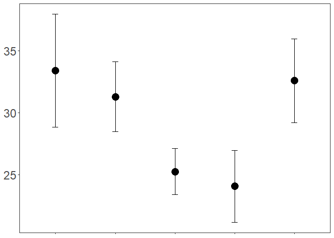

Re-analysis of Batstone et al. 2017 (five lines)
================
Rebecca Batstone
2020-02-01

## load packages

``` r
library("tidyverse") ## includes ggplot2, dplyr, readr, stringr
library("cowplot") ## paneled graphs
library("ggrepel") # geom_text_repel function
library("reshape2") ## for melting datasheets
library("car") ## Anova function
library("lme4") ## mixed effects models
library("multcomp") ## post-hoc comps
library("multcompView") ## summarize key variables
library("RVAideMemoire") ## residual diagnotics
```

## load data

``` r
SR_rhiz <- read_csv("./reanalyses_files/splitroot_reanalysis_rhizobia.csv", 
    col_types = cols(line = col_factor(levels = c("270", 
        "276", "267", "313", "279"))))

SR_fert <- read_csv("./reanalyses_files/splitroot_reanalysis_fertilizer.csv", 
    col_types = cols(line = col_factor(levels = c("270", 
        "276", "267", "313", "279"))))
```

## Set contrasts

``` r
# set effects contrasts (treat is an ordered factor w/ 4 levels, half with 2-lvls)
options(contrasts = c("contr.sum","contr.poly")) 
```

## Prep spreadsheets for analyses:

``` r
# create long version of rhiz
SR_rhiz_long1 <- SR_rhiz %>%
  gather(key = "treat", value = "root",
       Em1022.root, Em1021.root)

SR_rhiz_long2 <- SR_rhiz %>%
  gather(key = "treat", value = "nod",
       Em1022.nod, Em1021.nod)

SR_rhiz_long <- cbind(SR_rhiz_long1, SR_rhiz_long2[,23])

SR_rhiz_long <- SR_rhiz_long %>% mutate(treat=recode_factor(treat, 
                         Em1022.root="Em1022",
                         Em1021.root="Em1021"))

SR_rhiz_long$treat <- factor(SR_rhiz_long$treat, 
                             levels = c("Em1021", "Em1022"))
SR_rhiz_long$plant <- as.factor(SR_rhiz_long$plant)
# str(SR_rhiz_long)
## 54 obs., 27 plants

# create long version of fert
SR_fert_long <- SR_fert %>%
  gather(key = "treat", value = "root",
       high_BM, low_BM)

SR_fert_long <- SR_fert_long %>% mutate(treat=recode_factor(treat, 
                         high_BM="High-N",
                         low_BM="Low-N"))

SR_fert_long$treat <- factor(SR_fert_long$treat,
                             levels = c("Low-N", "High-N"))
SR_fert_long$plant <- as.factor(SR_fert_long$plant)
# str(SR_fert_long)
## 82 obs., 41 plants
```

## Models

``` r
## Rhizobia exp:

# model of shoot differences btw lines
glmm1_rhiz <- glmer(shoot ~ line + (1|tray),
                         family=Gamma(link="sqrt"), data = SR_rhiz)

plotresid(glmm1_rhiz, shapiro = TRUE)
```

<!-- -->

``` r
summary(glmm1_rhiz)
```

    ## Generalized linear mixed model fit by maximum likelihood (Laplace
    ##   Approximation) [glmerMod]
    ##  Family: Gamma  ( sqrt )
    ## Formula: shoot ~ line + (1 | tray)
    ##    Data: SR_rhiz
    ## 
    ##      AIC      BIC   logLik deviance df.resid 
    ##   -165.6   -156.5     89.8   -179.6       20 
    ## 
    ## Scaled residuals: 
    ##     Min      1Q  Median      3Q     Max 
    ## -1.5819 -0.8527  0.1809  0.6403  2.2724 
    ## 
    ## Random effects:
    ##  Groups   Name        Variance Std.Dev.
    ##  tray     (Intercept) 0.00000  0.0000  
    ##  Residual             0.03752  0.1937  
    ## Number of obs: 27, groups:  tray, 9
    ## 
    ## Fixed effects:
    ##              Estimate Std. Error t value Pr(>|z|)    
    ## (Intercept)  0.205277   0.004767  43.058  < 2e-16 ***
    ## line1       -0.054778   0.009420  -5.815 6.07e-09 ***
    ## line2       -0.015805   0.009617  -1.643   0.1003    
    ## line3        0.015131   0.008909   1.698   0.0894 .  
    ## line4        0.054081   0.012387   4.366 1.27e-05 ***
    ## ---
    ## Signif. codes:  0 '***' 0.001 '**' 0.01 '*' 0.05 '.' 0.1 ' ' 1
    ## 
    ## Correlation of Fixed Effects:
    ##       (Intr) line1  line2  line3 
    ## line1 -0.016                     
    ## line2  0.011 -0.249              
    ## line3 -0.091 -0.216 -0.227       
    ## line4  0.353 -0.367 -0.370 -0.360
    ## convergence code: 0
    ## boundary (singular) fit: see ?isSingular

``` r
Anova(glmm1_rhiz, type=2)
```

    ## Analysis of Deviance Table (Type II Wald chisquare tests)
    ## 
    ## Response: shoot
    ##       Chisq Df Pr(>Chisq)    
    ## line 44.854  4  4.264e-09 ***
    ## ---
    ## Signif. codes:  0 '***' 0.001 '**' 0.01 '*' 0.05 '.' 0.1 ' ' 1

``` r
summary(glht(glmm1_rhiz, mcp(line="Tukey")))
```

    ## 
    ##   Simultaneous Tests for General Linear Hypotheses
    ## 
    ## Multiple Comparisons of Means: Tukey Contrasts
    ## 
    ## 
    ## Fit: glmer(formula = shoot ~ line + (1 | tray), data = SR_rhiz, family = Gamma(link = "sqrt"))
    ## 
    ## Linear Hypotheses:
    ##                Estimate Std. Error z value Pr(>|z|)    
    ## 276 - 270 == 0  0.03897    0.01504   2.591  0.06836 .  
    ## 267 - 270 == 0  0.06991    0.01430   4.890  < 0.001 ***
    ## 313 - 270 == 0  0.10886    0.01811   6.012  < 0.001 ***
    ## 279 - 270 == 0  0.05615    0.01182   4.751  < 0.001 ***
    ## 267 - 276 == 0  0.03094    0.01451   2.131  0.19780    
    ## 313 - 276 == 0  0.06989    0.01828   3.823  0.00118 ** 
    ## 279 - 276 == 0  0.01718    0.01208   1.422  0.60105    
    ## 313 - 267 == 0  0.03895    0.01767   2.204  0.16995    
    ## 279 - 267 == 0 -0.01376    0.01114  -1.236  0.72008    
    ## 279 - 313 == 0 -0.05271    0.01573  -3.351  0.00674 ** 
    ## ---
    ## Signif. codes:  0 '***' 0.001 '**' 0.01 '*' 0.05 '.' 0.1 ' ' 1
    ## (Adjusted p values reported -- single-step method)

``` r
# model of root differences btw lines and treat
glmm2_rhiz <- glmer(root ~ line*treat + (1|tray) + (1|plant),
                         family=Gamma(link="sqrt"), data = SR_rhiz_long)
plotresid(glmm2_rhiz, shapiro = TRUE)
```

<!-- -->

``` r
summary(glmm2_rhiz)
```

    ## Generalized linear mixed model fit by maximum likelihood (Laplace
    ##   Approximation) [glmerMod]
    ##  Family: Gamma  ( sqrt )
    ## Formula: root ~ line * treat + (1 | tray) + (1 | plant)
    ##    Data: SR_rhiz_long
    ## 
    ##      AIC      BIC   logLik deviance df.resid 
    ##   -342.3   -316.4    184.1   -368.3       41 
    ## 
    ## Scaled residuals: 
    ##     Min      1Q  Median      3Q     Max 
    ## -1.6837 -0.5814 -0.1057  0.6179  3.1256 
    ## 
    ## Random effects:
    ##  Groups   Name        Variance  Std.Dev. 
    ##  plant    (Intercept) 2.207e-04 1.485e-02
    ##  tray     (Intercept) 1.036e-09 3.218e-05
    ##  Residual             2.759e-01 5.253e-01
    ## Number of obs: 54, groups:  plant, 27; tray, 9
    ## 
    ## Fixed effects:
    ##               Estimate Std. Error t value Pr(>|z|)    
    ## (Intercept)   0.116074   0.002989  38.834  < 2e-16 ***
    ## line1        -0.036404   0.003208 -11.347  < 2e-16 ***
    ## line2        -0.016331   0.003178  -5.139 2.77e-07 ***
    ## line3         0.044506   0.003189  13.957  < 2e-16 ***
    ## line4        -0.008055   0.003195  -2.521   0.0117 *  
    ## treat1        0.020282   0.002760   7.348 2.02e-13 ***
    ## line1:treat1  0.004893   0.003108   1.574   0.1154    
    ## line2:treat1  0.018114   0.003063   5.913 3.36e-09 ***
    ## line3:treat1  0.003307   0.003150   1.050   0.2939    
    ## line4:treat1 -0.030828   0.003096  -9.958  < 2e-16 ***
    ## ---
    ## Signif. codes:  0 '***' 0.001 '**' 0.01 '*' 0.05 '.' 0.1 ' ' 1
    ## 
    ## Correlation of Fixed Effects:
    ##             (Intr) line1  line2  line3  line4  treat1 ln1:t1 ln2:t1 ln3:t1
    ## line1        0.068                                                        
    ## line2        0.051 -0.096                                                 
    ## line3        0.056 -0.096 -0.096                                          
    ## line4        0.059 -0.096 -0.097 -0.096                                   
    ## treat1       0.057  0.007  0.025 -0.001 -0.018                            
    ## line1:tret1  0.007  0.025  0.004  0.006  0.007  0.066                     
    ## line2:tret1  0.025  0.004  0.044  0.005  0.006  0.038 -0.124              
    ## line3:tret1  0.000  0.006  0.005  0.017  0.007  0.092 -0.126 -0.126       
    ## line4:tret1 -0.020  0.006  0.005  0.007 -0.001  0.058 -0.126 -0.125 -0.126
    ## convergence code: 0
    ## boundary (singular) fit: see ?isSingular

``` r
Anova(glmm2_rhiz, type=3)
```

    ## Analysis of Deviance Table (Type III Wald chisquare tests)
    ## 
    ## Response: root
    ##                Chisq Df Pr(>Chisq)    
    ## (Intercept) 1508.049  1  < 2.2e-16 ***
    ## line         328.109  4  < 2.2e-16 ***
    ## treat         53.989  1  2.016e-13 ***
    ## line:treat   122.727  4  < 2.2e-16 ***
    ## ---
    ## Signif. codes:  0 '***' 0.001 '**' 0.01 '*' 0.05 '.' 0.1 ' ' 1

``` r
# model of root differences btw lines and treat
glmm3_rhiz <- glmer(nod ~ line*treat + (1|tray) + (1|plant),
                         family=poisson(link="sqrt"), data = SR_rhiz_long)
# model failed to converge
plotresid(glmm3_rhiz, shapiro = TRUE) # slight pattern, normal
```

<!-- -->

``` r
summary(glmm3_rhiz)
```

    ## Generalized linear mixed model fit by maximum likelihood (Laplace
    ##   Approximation) [glmerMod]
    ##  Family: poisson  ( sqrt )
    ## Formula: nod ~ line * treat + (1 | tray) + (1 | plant)
    ##    Data: SR_rhiz_long
    ## 
    ##      AIC      BIC   logLik deviance df.resid 
    ##    274.8    298.7   -125.4    250.8       42 
    ## 
    ## Scaled residuals: 
    ##     Min      1Q  Median      3Q     Max 
    ## -1.7929 -0.5486 -0.0484  0.4176  3.2549 
    ## 
    ## Random effects:
    ##  Groups Name        Variance Std.Dev.
    ##  plant  (Intercept) 0.02108  0.1452  
    ##  tray   (Intercept) 0.01350  0.1162  
    ## Number of obs: 54, groups:  plant, 27; tray, 9
    ## 
    ## Fixed effects:
    ##              Estimate Std. Error z value Pr(>|z|)    
    ## (Intercept)   2.12857    0.10390  20.487  < 2e-16 ***
    ## line1        -0.20618    0.23918  -0.862 0.388679    
    ## line2        -0.53684    0.20668  -2.598 0.009391 ** 
    ## line3        -0.14919    0.18326  -0.814 0.415602    
    ## line4         0.34734    0.21060   1.649 0.099090 .  
    ## treat1       -0.31139    0.08528  -3.652 0.000261 ***
    ## line1:treat1  0.69116    0.21331   3.240 0.001195 ** 
    ## line2:treat1  0.52276    0.18011   2.902 0.003703 ** 
    ## line3:treat1 -0.41825    0.14947  -2.798 0.005140 ** 
    ## line4:treat1 -1.16725    0.17966  -6.497 8.19e-11 ***
    ## ---
    ## Signif. codes:  0 '***' 0.001 '**' 0.01 '*' 0.05 '.' 0.1 ' ' 1
    ## 
    ## Correlation of Fixed Effects:
    ##             (Intr) line1  line2  line3  line4  treat1 ln1:t1 ln2:t1 ln3:t1
    ## line1        0.302                                                        
    ## line2        0.120 -0.267                                                 
    ## line3       -0.151 -0.344 -0.263                                          
    ## line4        0.023 -0.372 -0.313 -0.217                                   
    ## treat1      -0.001  0.003 -0.009  0.002 -0.001                            
    ## line1:tret1  0.002 -0.001  0.005 -0.001  0.000  0.301                     
    ## line2:tret1 -0.009 -0.002 -0.007  0.002  0.004  0.073 -0.361              
    ## line3:tret1  0.004 -0.001  0.003  0.004 -0.001 -0.176 -0.329 -0.229       
    ## line4:tret1  0.000 -0.001  0.005 -0.001 -0.001  0.069 -0.360 -0.292 -0.227

``` r
Anova(glmm3_rhiz, type=3)
```

    ## Analysis of Deviance Table (Type III Wald chisquare tests)
    ## 
    ## Response: nod
    ##               Chisq Df Pr(>Chisq)    
    ## (Intercept) 419.710  1  < 2.2e-16 ***
    ## line         21.527  4  0.0002489 ***
    ## treat        13.334  1  0.0002607 ***
    ## line:treat   66.958  4   9.95e-14 ***
    ## ---
    ## Signif. codes:  0 '***' 0.001 '**' 0.01 '*' 0.05 '.' 0.1 ' ' 1

``` r
## Fertilizer exp:
# model of shoot differences btw lines
glmm1_fert <- glmer(shoot ~ line + (1|tray),
                         family=Gamma(link="sqrt"), data = SR_fert)

plotresid(glmm1_fert, shapiro = TRUE)
```

<!-- -->

``` r
summary(glmm1_fert)
```

    ## Generalized linear mixed model fit by maximum likelihood (Laplace
    ##   Approximation) [glmerMod]
    ##  Family: Gamma  ( sqrt )
    ## Formula: shoot ~ line + (1 | tray)
    ##    Data: SR_fert
    ## 
    ##      AIC      BIC   logLik deviance df.resid 
    ##   -265.9   -253.9    139.9   -279.9       34 
    ## 
    ## Scaled residuals: 
    ##      Min       1Q   Median       3Q      Max 
    ## -1.75224 -0.79915  0.01018  0.76419  1.87002 
    ## 
    ## Random effects:
    ##  Groups   Name        Variance  Std.Dev.
    ##  tray     (Intercept) 4.998e-05 0.007069
    ##  Residual             7.521e-02 0.274246
    ## Number of obs: 41, groups:  tray, 17
    ## 
    ## Fixed effects:
    ##              Estimate Std. Error t value Pr(>|z|)    
    ## (Intercept)  0.171699   0.005752  29.852   <2e-16 ***
    ## line1        0.010671   0.012439   0.858   0.3910    
    ## line2        0.009403   0.009897   0.950   0.3421    
    ## line3       -0.012784   0.008117  -1.575   0.1153    
    ## line4       -0.016231   0.009126  -1.778   0.0753 .  
    ## ---
    ## Signif. codes:  0 '***' 0.001 '**' 0.01 '*' 0.05 '.' 0.1 ' ' 1
    ## 
    ## Correlation of Fixed Effects:
    ##       (Intr) line1  line2  line3 
    ## line1  0.088                     
    ## line2 -0.174 -0.264              
    ## line3 -0.457 -0.179  0.007       
    ## line4 -0.284 -0.219 -0.041  0.043

``` r
Anova(glmm1_fert, type=2)
```

    ## Analysis of Deviance Table (Type II Wald chisquare tests)
    ## 
    ## Response: shoot
    ##       Chisq Df Pr(>Chisq)
    ## line 6.4503  4     0.1679

``` r
summary(glht(glmm1_fert, mcp(line="Tukey")))
```

    ## 
    ##   Simultaneous Tests for General Linear Hypotheses
    ## 
    ## Multiple Comparisons of Means: Tukey Contrasts
    ## 
    ## 
    ## Fit: glmer(formula = shoot ~ line + (1 | tray), data = SR_fert, family = Gamma(link = "sqrt"))
    ## 
    ## Linear Hypotheses:
    ##                  Estimate Std. Error z value Pr(>|z|)
    ## 276 - 270 == 0 -0.0012676  0.0178227  -0.071    1.000
    ## 267 - 270 == 0 -0.0234550  0.0160211  -1.464    0.572
    ## 313 - 270 == 0 -0.0269018  0.0169663  -1.586    0.492
    ## 279 - 270 == 0 -0.0017307  0.0237602  -0.073    1.000
    ## 267 - 276 == 0 -0.0221875  0.0127571  -1.739    0.396
    ## 313 - 276 == 0 -0.0256343  0.0137324  -1.867    0.322
    ## 279 - 276 == 0 -0.0004632  0.0217685  -0.021    1.000
    ## 313 - 267 == 0 -0.0034468  0.0119479  -0.288    0.998
    ## 279 - 267 == 0  0.0217243  0.0205019   1.060    0.819
    ## 279 - 313 == 0  0.0251711  0.0212205   1.186    0.749
    ## (Adjusted p values reported -- single-step method)

``` r
# model of root differences btw lines and treat
glmm2_fert <- glmer(root ~ line*treat + (1|tray) + (1|plant),
                         family=Gamma(link="sqrt"), data = SR_fert_long)
plotresid(glmm2_fert, shapiro = TRUE) 
```

<!-- -->

``` r
summary(glmm2_fert)
```

    ## Generalized linear mixed model fit by maximum likelihood (Laplace
    ##   Approximation) [glmerMod]
    ##  Family: Gamma  ( sqrt )
    ## Formula: root ~ line * treat + (1 | tray) + (1 | plant)
    ##    Data: SR_fert_long
    ## 
    ##      AIC      BIC   logLik deviance df.resid 
    ##   -621.6   -590.4    323.8   -647.6       69 
    ## 
    ## Scaled residuals: 
    ##     Min      1Q  Median      3Q     Max 
    ## -1.3309 -0.8537 -0.0175  0.3832  3.8500 
    ## 
    ## Random effects:
    ##  Groups   Name        Variance  Std.Dev.
    ##  plant    (Intercept) 5.023e-05 0.007088
    ##  tray     (Intercept) 1.144e-08 0.000107
    ##  Residual             4.704e-01 0.685886
    ## Number of obs: 82, groups:  plant, 41; tray, 17
    ## 
    ## Fixed effects:
    ##                Estimate Std. Error t value Pr(>|z|)    
    ## (Intercept)   0.0932760  0.0035714  26.117  < 2e-16 ***
    ## line1        -0.0005798  0.0056537  -0.103  0.91832    
    ## line2         0.0114581  0.0048473   2.364  0.01809 *  
    ## line3        -0.0094829  0.0047015  -2.017  0.04370 *  
    ## line4        -0.0140836  0.0048122  -2.927  0.00343 ** 
    ## treat1       -0.0253467  0.0034343  -7.380 1.58e-13 ***
    ## line1:treat1 -0.0026668  0.0055395  -0.481  0.63023    
    ## line2:treat1  0.0068410  0.0047730   1.433  0.15178    
    ## line3:treat1  0.0134737  0.0046255   2.913  0.00358 ** 
    ## line4:treat1  0.0204727  0.0048494   4.222 2.42e-05 ***
    ## ---
    ## Signif. codes:  0 '***' 0.001 '**' 0.01 '*' 0.05 '.' 0.1 ' ' 1
    ## 
    ## Correlation of Fixed Effects:
    ##             (Intr) line1  line2  line3  line4  treat1 ln1:t1 ln2:t1 ln3:t1
    ## line1       -0.013                                                        
    ## line2       -0.167 -0.073                                                 
    ## line3       -0.313 -0.061 -0.003                                          
    ## line4       -0.150 -0.078 -0.045 -0.007                                   
    ## treat1      -0.317  0.062  0.119  0.199  0.084                            
    ## line1:tret1  0.058 -0.374 -0.043 -0.051 -0.048 -0.015                     
    ## line2:tret1  0.117 -0.042 -0.204 -0.081 -0.062 -0.158 -0.079              
    ## line3:tret1  0.186 -0.052 -0.089 -0.203 -0.077 -0.326 -0.067 -0.009       
    ## line4:tret1  0.101 -0.043 -0.086 -0.119 -0.175 -0.129 -0.078 -0.083 -0.044
    ## convergence code: 0
    ## Model failed to converge with max|grad| = 0.0232602 (tol = 0.001, component 1)

``` r
Anova(glmm2_fert, type=3)
```

    ## Analysis of Deviance Table (Type III Wald chisquare tests)
    ## 
    ## Response: root
    ##               Chisq Df Pr(>Chisq)    
    ## (Intercept) 682.106  1  < 2.2e-16 ***
    ## line         17.765  4   0.001372 ** 
    ## treat        54.471  1  1.577e-13 ***
    ## line:treat   30.826  4  3.322e-06 ***
    ## ---
    ## Signif. codes:  0 '***' 0.001 '**' 0.01 '*' 0.05 '.' 0.1 ' ' 1

## Summarize data

``` r
## Rhizobia exp:

# convert shoot bm to mg
SR_rhiz$shoot.t <- SR_rhiz$shoot*1000

# summarize shoot for lines
SR_rhiz_sum_shoot <- SR_rhiz %>%
  group_by(line) %>%
  summarise(mean_shoot = mean(shoot.t, na.rm = TRUE), 
            SE_shoot = sd(shoot.t, na.rm = TRUE)/sqrt(length(shoot.t)))

# summarize root and nodules
# convert root bm to mg
SR_rhiz_long$root.t <- SR_rhiz_long$root*1000

# summarize root for lines and treat
SR_rhiz_long_sum <- SR_rhiz_long %>%
  group_by(line, treat) %>%
  summarise(mean_root = mean(root.t, na.rm = TRUE), 
            SE_root = sd(root.t, na.rm = TRUE)/sqrt(length(root.t)),
            mean_nod = mean(nod, na.rm = TRUE), 
            SE_nod = sd(nod, na.rm = TRUE)/sqrt(length(nod))
            )

## Fertilizer exp:

# convert shoot bm to mg
SR_fert$shoot.t <- SR_fert$shoot*1000

# summarize shoot for lines
SR_fert_sum_shoot <- SR_fert %>%
  group_by(line) %>%
  summarise(mean_shoot = mean(shoot.t, na.rm = TRUE), 
            SE_shoot = sd(shoot.t, na.rm = TRUE)/sqrt(length(shoot.t)))

# convert root bm to mg
SR_fert_long$root.t <- SR_fert_long$root*1000

# summarize root for lines and treat
SR_fert_long_sum <- SR_fert_long %>%
  group_by(line, treat) %>%
  summarise(mean_root = mean(root.t, na.rm = TRUE), 
            SE_root = sd(root.t, na.rm = TRUE)/sqrt(length(root.t)),
            )
```

## Plot figures

``` r
# plots for lines of interest
require(ggrepel)

# Figure S1 for paper:
# Fertilizer experiment:
(plot_fert_shoot <- ggplot(SR_fert_sum_shoot, 
                                      aes(x=line, y = mean_shoot, colour=line)) + 
   geom_point(size=5,colour="black") + 
   geom_errorbar(aes(ymin = mean_shoot-SE_shoot, 
                     ymax=mean_shoot+SE_shoot), 
                 width=0.1, colour="black") +
   ylab(NULL) + 
   xlab(NULL) + 
   theme_bw() +
   scale_size(guide=FALSE) +
   scale_colour_discrete(name="Plant line") +
   theme(panel.grid.major = element_blank(),
        panel.grid.minor = element_blank(),
        legend.title = element_text(colour="black", size=16, face="bold"),
        legend.text = element_text(colour="black", size=12),
        legend.position = "none",
        axis.text.y = element_text(size=18),
        axis.title.x = element_blank(),
        axis.text.x = element_blank(),
        axis.title.y = element_text(size=20)
        )
  )
```

<!-- -->

``` r
(plot_fert_root <- ggplot(SR_fert_long_sum,
                          aes(x=treat, y = mean_root, group=line, colour=line, shape=treat)) + 
   geom_point(size=5, position = position_dodge(0.1), colour="black") + 
   geom_line(position = position_dodge(0.1), colour="black") +
   geom_errorbar(aes(ymin = mean_root-SE_root, ymax=mean_root+SE_root), width=0.1,
                 position = position_dodge(0.1), colour="black") +
   geom_text_repel(data = subset(SR_fert_long_sum, treat == "High-N"),
             aes(label=line), nudge_x = 0.2, segment.color = 'transparent', colour="black") + 
   ylab("Root biomass (mg)") + 
   xlab(NULL) + 
   theme_bw() +
   scale_x_discrete(breaks=c("Low-N","High-N"),
        labels=c("20%-N", "80%-N")) +  
   scale_size(guide=FALSE) +
   scale_shape_manual(values=c(1,19)) +
   theme(panel.grid.major = element_blank(),
        panel.grid.minor = element_blank(),
        legend.title = element_text(colour="black", size=16, face="bold"),
        legend.text = element_text(colour="black", size=12),
        legend.position = "none",
        axis.text.y = element_text(size=18),
        axis.text.x = element_text(size=18),
        axis.title.x = element_blank(), 
        axis.title.y = element_text(size=20)
        )
  )
```

<!-- -->

``` r
# rhizobia experiment
(plot_rhiz_shoot <- ggplot(SR_rhiz_sum_shoot, 
                                      aes(x=line, y = mean_shoot, colour=line)) + 
   geom_point(size=5, colour="black") + 
   geom_errorbar(aes(ymin = mean_shoot-SE_shoot, ymax=mean_shoot+SE_shoot), 
                 width=0.1, colour="black") +
   ylab(NULL) + 
   xlab("Plant line") + 
   theme_bw() +
   scale_size(guide=FALSE) +
   scale_colour_discrete(name="Plant line") +
   theme(panel.grid.major = element_blank(),
        panel.grid.minor = element_blank(),
        legend.title = element_text(colour="black", size=16, face="bold"),
        legend.text = element_text(colour="black", size=12),
        legend.position = "none",
        axis.text.y = element_text(size=18),
        axis.text.x = element_text(size=18),
        axis.title.x = element_text(size=20),
        axis.title.y = element_text(size=20)
        )
  )
```

<!-- -->

``` r
(plot_rhiz_nod <- ggplot(SR_rhiz_long_sum, aes(x=treat, y = mean_nod, 
                                                  group=line, colour=line, shape=treat)) + 
   geom_point(size=5, position = position_dodge(0.1), colour = "black") + 
   geom_line(position = position_dodge(0.1), colour = "black") +
   geom_errorbar(aes(ymin = mean_nod-SE_nod, ymax=mean_nod+SE_nod), width=0.1,
                 position = position_dodge(0.1), colour = "black") +
   geom_text_repel(data = subset(SR_rhiz_long_sum, treat == "Em1022"),
             aes(label=line), nudge_x = 0.2, segment.color = 'transparent', colour = "black") + 
   ylab("Nodules (no.)") + 
   xlab("Treatment") + 
   theme_bw() +
   scale_x_discrete(breaks=c("Em1021","Em1022"),
        labels=c("Em1021-\n inoculated", "Em1022-\n inoculated")) +
   scale_size(guide=FALSE) +
   scale_shape_manual(values=c(1,19)) +  
   scale_colour_discrete(name="Plant line") +
   theme(panel.grid.major = element_blank(),
        panel.grid.minor = element_blank(),
        legend.title = element_text(colour="black", size=16, face="bold"),
        legend.text = element_text(colour="black", size=12),
        legend.position = "none",
        axis.text.y = element_text(size=18),
        axis.text.x = element_text(size=18),
        axis.title.x = element_text(size=20),
        axis.title.y = element_text(size=20)
        )
  )
```

<!-- -->

``` r
figS2_base <- plot_grid(plot_fert_shoot, plot_fert_root,
                         plot_rhiz_shoot, plot_rhiz_nod,
          align = "hv",
          ncol = 2, nrow = 2,
          labels = "AUTO")

# add on the shared y axis title
figS2_y_axis <- ggdraw() + draw_label("Shoot biomass (mg)", size = 24, angle=90)

# put them together
figS2 <- plot_grid(figS2_y_axis, figS2_base, ncol=2, rel_widths=c(0.04, 1)) 
# rel_heights or widths values control text margins

save_plot("./figures_files/FigS1_reanalysis.pdf", figS2,
          ncol = 2, # we're saving a grid plot of 3 columns
          nrow = 2, # and 2 rows
          # each individual subplot should have an aspect ratio of 1.3
          base_aspect_ratio = 1.3
          )
```
